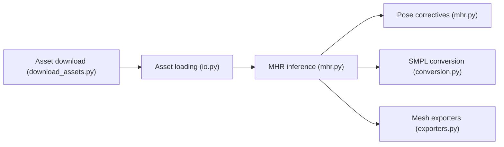

# facebookresearch/MHR

> Modèle paramétrique de corps humain 3D en PyTorch, avec identité, pose et expressions faciales, pour la recherche.

## Le problème
Il faut un modèle de corps humain différentiable, avec visage et mains, pour estimer ou optimiser des poses.

## Ce que ça fait vraiment
À partir de 45 paramètres d'identité, 204 de pose et 72 d'expression, renvoie les sommets du maillage et l'état du squelette. 7 niveaux de détail, correctifs de pose par réseau de neurones, gradients PyTorch, conversion vers SMPL/SMPL-X, visualiseur web. Les actifs du modèle se téléchargent à part.

## Comment c'est branché


## Essayer
```bash
pixi install
pixi run download-assets
pixi shell
python demo.py
pip install mhr
mhr-download-assets --member assets/mhr_model.pt --output mhr_model.pt
```

## Coût et pièges
Python ≥ 3.11 et pymomentum ≥ 0.1.90 ; l'installation pip est marquée expérimentale, Pixi recommandé. Le modèle TorchScript ne gère que le LOD 1.

## Ce que ce n'est pas
Pas un outil d'estimation de pose depuis des images : le README renvoie vers Sam3D pour cela.

## Alternatives
SMPL/SMPL-X (conversion fournie), Sam3D pour l'inférence depuis images.

## Pour toi
À surveiller : pertinent si tu fais de la vision 3D ou de la récupération de mouvement ; sans rapport sinon.

