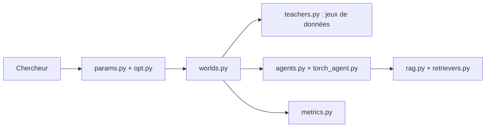

# facebookresearch/ParlAI

> Cadre Python pour entraîner et évaluer des modèles de dialogue sur plus de 100 jeux de données.

## Le problème
Comparer des modèles de dialogue exige des jeux de données hétérogènes et des protocoles d'évaluation distincts.

## Ce que ça fait vraiment
Fournit une API commune pour plus de 100 jeux de données (PersonaChat, SQuAD, etc.), des modèles de référence et préentraînés, des scripts d'entraînement et d'évaluation, ainsi que l'intégration d'Amazon Mechanical Turk et de Facebook Messenger. Les données se téléchargent dans `~/ParlAI/data`.

## Comment c'est branché


## Essayer
```bash
python3.8 -m venv venv
venv/bin/pip install parlai
parlai display_data -t squad
parlai eval_model -m ir_baseline -t personachat -dt valid
```

## Coût et pièges
Gratuit. Python 3.8+, PyTorch 1.6+, Windows non supporté. L'installation depuis les sources peut échouer sur PyTorch.

## Ce que ce n'est pas
Le dépôt est archivé : plus de corrections à attendre. Il date d'avant les LLM modernes et ne les couvre pas.

## Alternatives
- Aucune alternative nommée dans le README.

## Pour toi
À ignorer : archivé et antérieur aux LLM actuels ; à ne consulter que pour d'anciens jeux de données de dialogue.

