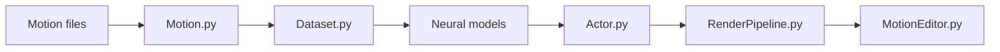

# facebookresearch/ai4animationpy

> Framework Python d'animation de personnages par réseaux de neurones, avec traitement de mocap et rendu intégré.

## Le problème
Les recherches en animation pilotée par IA exigeaient Unity pour la visualisation et des passerelles ONNX avec PyTorch.

## Ce que ça fait vraiment
Tout en NumPy/PyTorch : architecture ECS avec boucle de mise à jour, import GLB/FBX/BVH vers un format `.npz`, MLP, autoencodeurs et Codebook Matching avec utilitaires d'entraînement, cinématique inverse FABRIK, rendu temps réel (ombres, SSAO, bloom), trois modes Standalone, Headless et Manual. Rétropropagation à travers l'inférence possible. Physique, audio et planification de chemin annoncés « bientôt ».

## Comment c'est branché


## Essayer
```python
from ai4animation import Motion
motion = Motion.LoadFromGLB("character.glb")
motion.SaveToNPZ("character")
```
```bash
convert --input_dir path/to/motions --output_dir path/to/output
```

## Coût et pièges
Gratuit. Les gains annoncés (génération de données ~4 h contre plus) viennent de l'auteur. Licence présente mais non identifiée par GitHub.

## Ce que ce n'est pas
Pas un moteur de jeu complet : physique et audio ne sont pas encore là.

## Alternatives
AI4Animation (version Unity) : plus ancienne, dépend d'Unity et d'ONNX.

## Pour toi
À surveiller : pertinent pour la recherche en animation ou mocap, trop spécialisé sinon ; clarifie la licence avant usage.

