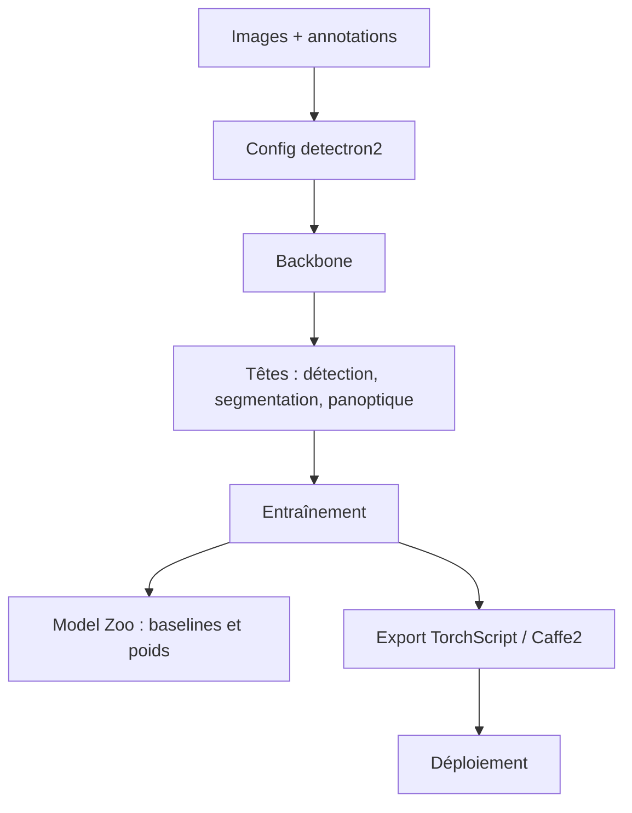

# facebookresearch/detectron2

> Bibliothèque de détection et segmentation d'images de Facebook AI Research, successeur de Detectron.

## Le problème
Réimplémenter une tête de détection ou de segmentation correcte coûte des semaines et se compare mal à la littérature.
Sans modèles de référence entraînés, impossible de savoir si votre baseline est juste.

## Ce que ça fait vraiment
Fournit des algorithmes de détection et de segmentation : segmentation panoptique, DensePose, Cascade R-CNN, boîtes orientées, PointRend, DeepLab, ViTDet, MViTv2.
S'utilise comme bibliothèque, pour construire des projets de recherche par-dessus ; le dossier `projects/` en donne des exemples.
Les modèles s'exportent en TorchScript ou au format Caffe2 pour le déploiement.
Un Model Zoo publie un large jeu de résultats de référence et de modèles entraînés à télécharger.

## Comment c'est branché

## Essayer
Aucune commande n'est présente dans le README : il renvoie vers les « installation instructions », le guide « Getting Started » et un notebook Colab. Non documenté.

## Coût et pièges
Gratuit ; le coût réel est le GPU d'entraînement et le temps d'annotation.
README volontairement court : toute la documentation utile est hors dépôt, à suivre par liens.

## Ce que ce n'est pas
Ce n'est pas un outil clé en main : c'est une bibliothèque de recherche à intégrer dans du code à vous.
Ce n'est pas un projet récent : l'entrée BibTeX date de 2019 et le README ne mentionne aucune évolution postérieure.
Ce n'est pas orienté transformers modernes de bout en bout, malgré ViTDet et MViTv2.

## Alternatives
- Detectron — le prédécesseur, cité ; sans intérêt aujourd'hui.
- maskrcnn-benchmark — également remplacé par detectron2 selon le README.

## Pour toi
À sortir seulement pour reproduire une baseline de vision classique ; sinon, l'écosystème a bougé ailleurs.
