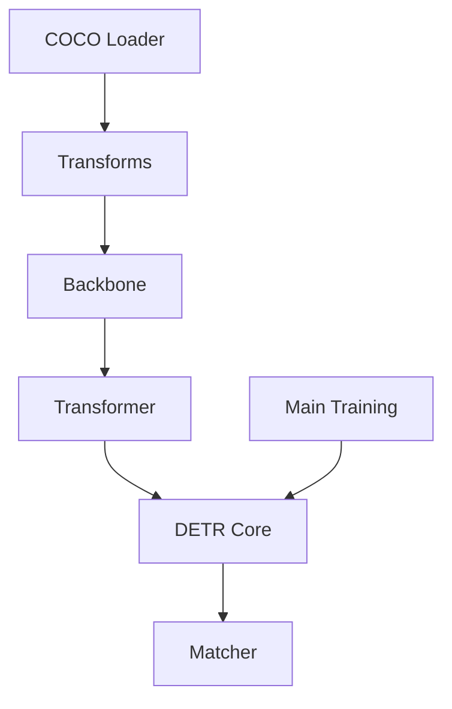

# facebookresearch/detr

> Code d'entraînement et modèles préentraînés de DETR, la détection d'objets par transformer. Il est archivé.

## Le problème
Les détecteurs classiques reposent sur des ancres et une étape NMS réglées à la main, lourdes à maintenir.

## Ce que ça fait vraiment
DETR traite la détection comme une prédiction d'ensemble : une perte globale par appariement bipartite, un encodeur-décodeur transformer et des requêtes d'objets apprises.
Modèles R50 et R101 (en variantes DC5), de 42 à 44,9 AP sur COCO, et une version panoptique.
Chargement via `torch.hub`, entraînement avec `main.py`, multi-nœuds avec submitit, et un wrapper Detectron2 (`d2/`).

## Comment c'est branché


## Essayer
```bash
git clone https://github.com/facebookresearch/detr.git
conda install -c pytorch pytorch torchvision
conda install cython scipy
python -m torch.distributed.launch --nproc_per_node=8 --use_env main.py --coco_path /path/to/coco
python main.py --batch_size 2 --no_aux_loss --eval --resume https://dl.fbaipublicfiles.com/detr/detr-r50-e632da11.pth --coco_path /path/to/coco
```

## Coût et pièges
Entraîner 300 époques prend environ 6 jours sur 8 V100. Le projet est archivé et n'est plus maintenu.

## Ce que ce n'est pas
Ce n'est pas l'état de l'art actuel. Ce n'est pas une bibliothèque : le README le dit, c'est un simple `main.py`.

## Alternatives
- Detectron2 : le README fournit un wrapper pour l'y intégrer.

## Pour toi
À ignorer comme outil : il est archivé. Il reste une lecture de référence si tu travailles en vision.
