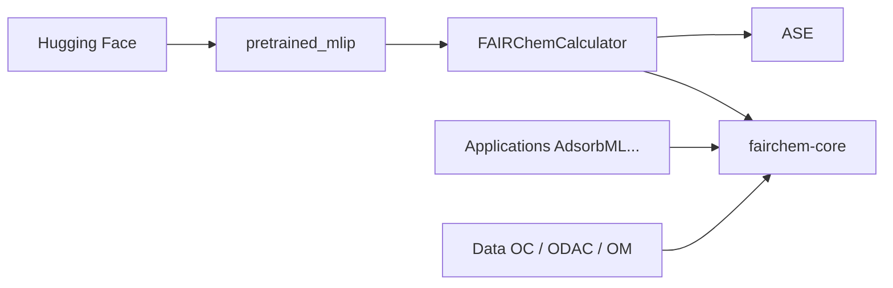

# facebookresearch/fairchem

> Dépôt de FAIR Chemistry : modèles UMA, données et outils pour la chimie quantique et les matériaux.

## Le problème
Calculer énergies et forces d'atomes par DFT est très coûteux ; un potentiel appris généraliste accélère relaxations et dynamique moléculaire.

## Ce que ça fait vraiment
Le paquet `fairchem-core` fournit les modèles pré-entraînés UMA (uma-s, uma-m), utilisables via un calculateur ASE `FAIRChemCalculator` avec une tâche par domaine (oc20, omat, omol, odac, omc…). Il gère relaxations, dynamique moléculaire, écart de spin et l'inférence multi-GPU (Ray). Le monorepo contient aussi applications (AdsorbML, cattsunami, ocx), modules de données et configs.

## Comment c'est branché


## Essayer
```bash
pip install fairchem-core
huggingface-cli login
```
```python
from fairchem.core import pretrained_mlip, FAIRChemCalculator
predictor = pretrained_mlip.get_predict_unit("uma-s-1p2p1", device="cuda")
calc = FAIRChemCalculator(predictor, task_name="oc20")
```

## Coût et pièges
Compte Hugging Face avec accès demandé au dépôt UMA. GPU CUDA pour un usage réaliste. Les modèles OMat24 ne sont pas compatibles avec les corrections Materials Project (à ne pas mélanger).

## Ce que ce n'est pas
Pas un logiciel DFT : il approxime des calculs appris. Licence présente mais non identifiée par GitHub, à vérifier, notamment pour les poids.

## Alternatives
- Aucune alternative nommée dans le README.

## Pour toi
Surveiller : très utile en science des matériaux, hors de ton champ sinon ; vérifie la licence avant tout usage.
