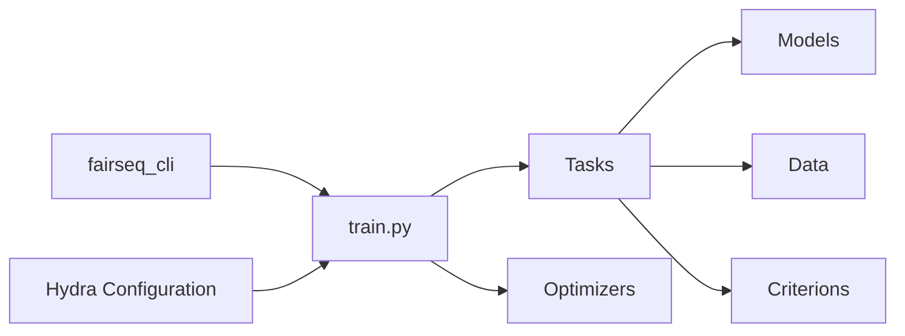

# facebookresearch/fairseq

> Boîte à outils PyTorch de modélisation de séquences de Meta, archivée, pour la recherche NLP et parole.

## Le problème
Reproduire les papiers de traduction, modèles de langue ou parole exigeait des implémentations de référence entraînables à grande échelle.

## Ce que ça fait vraiment
Implémentations de référence : Transformer, RoBERTa, BART, mBART, XLM-R, wav2vec 2.0, modèles non autorégressifs, etc.
Entraînement multi-GPU/multi-nœuds, précision mixte, sharding des paramètres, déport CPU.
Génération par beam search, échantillonnage, décodage contraint ; configuration Hydra.
Modèles pré-entraînés via `torch.hub`.

## Comment c'est branché


## Essayer
```bash
git clone https://github.com/pytorch/fairseq
cd fairseq
pip install --editable ./
```

## Coût et pièges
GPU NVIDIA et NCCL pour entraîner. Dépôt archivé : plus de correctifs.

## Ce que ce n'est pas
Plus maintenu ; pas une base pour un nouveau projet. Pas simple d'accès hors recherche.

## Alternatives
- NVIDIA apex : cité comme complément pour accélérer l'entraînement, pas un remplaçant.

## Pour toi
À consulter pour reproduire un papier ancien ; sinon passe ton chemin.
