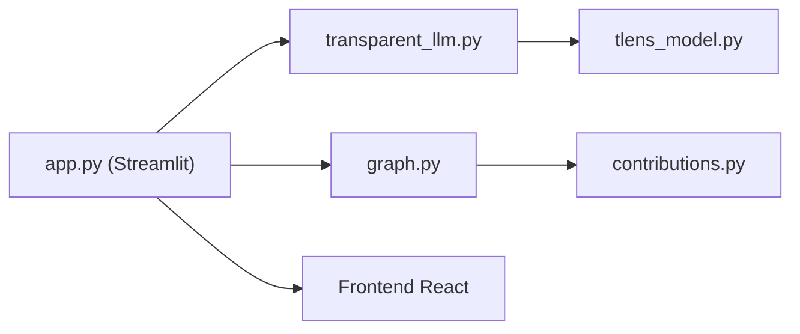

# facebookresearch/llm-transparency-tool

> Application Streamlit pour inspecter le graphe de contributions interne d'un LLM, destinée aux chercheurs en interprétabilité.

## Le problème
Comprendre quelles têtes d'attention et quels blocs FFN influencent la prédiction d'un token est difficile sans visualisation.

## Ce que ça fait vraiment
Charge un modèle, exécute un prompt, puis construit un graphe de contributions à partir d'un token choisi, avec seuil réglable. On clique sur arêtes, têtes d'attention, blocs FFN et neurones pour voir ce qui est promu ou supprimé, et on projette une représentation sur le vocabulaire de sortie. S'appuie sur TransformerLens.

## Comment c'est branché


## Essayer
```bash
docker build -t llm_transparency_tool .
docker run --rm -p 7860:7860 llm_transparency_tool
streamlit run llm_transparency_tool/server/app.py -- config/local.json
```

## Coût et pièges
Gratuit. Installation locale avec conda, `pip install -e .` et build du frontend (yarn). Mémoire importante selon le modèle choisi.

## Ce que ce n'est pas
Pas maintenu : archivé, dernier push en décembre 2024. Pas un outil d'évaluation ni d'audit de sécurité, c'est une exploration manuelle.

## Alternatives
- TransformerLens : bibliothèque sur laquelle il s'appuie.

## Pour toi
À ignorer pour un usage courant : archivé et sans licence identifiée, utile seulement comme référence pédagogique en interprétabilité.

