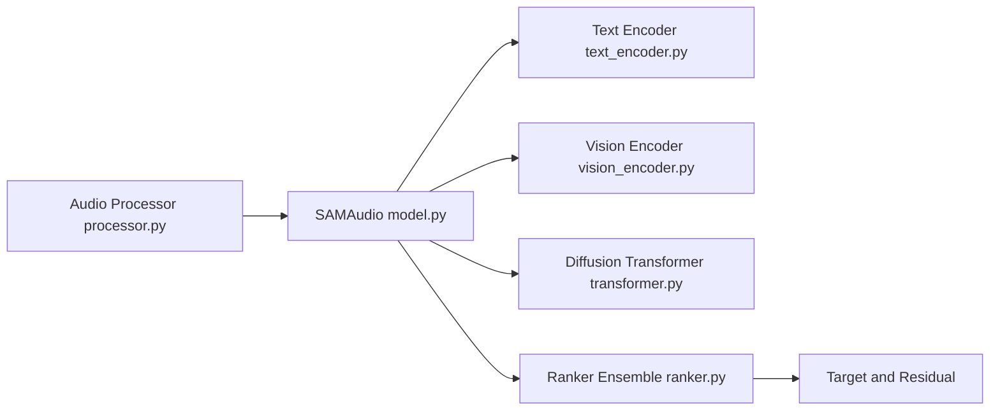

# facebookresearch/sam-audio

> Modèle de fondation de Meta qui isole un son dans un mélange via texte, vidéo ou intervalle de temps.

## Le problème
Séparer une source précise (voix, instrument, klaxon) d'un mélange audio demande des modèles spécialisés par type de son.

## Ce que ça fait vraiment
`SAMAudio` prend un audio et un prompt (texte en groupe nominal/verbal minuscule, masque vidéo, ou plages temporelles) et renvoie une cible isolée et un résidu. Options : prédiction automatique d'intervalles et reranking de candidats par CLAP, Judge ou ImageBind. Modèles small/base/large et variantes `-tv`.

## Comment c'est branché


## Essayer
```bash
pip install .
hf auth login
```
```python
from sam_audio import SAMAudio, SAMAudioProcessor
model = SAMAudio.from_pretrained("facebook/sam-audio-large")
processor = SAMAudioProcessor.from_pretrained("facebook/sam-audio-large")
```

## Coût et pièges
Python ≥ 3.11 et GPU CUDA recommandé. Il faut demander l'accès aux checkpoints sur Hugging Face puis s'authentifier. `predict_spans` et `reranking_candidates` améliorent la qualité mais coûtent latence et mémoire.

## Ce que ce n'est pas
Pas un outil prêt à l'emploi grand public : une bibliothèque de recherche. Licence présente mais non identifiée par GitHub : à lire avant tout usage commercial.

## Alternatives
Aucune alternative nommée dans le README.

## Pour toi
À surveiller : intéressant pour du traitement audio multimodal, mais accès gated et licence à clarifier.

