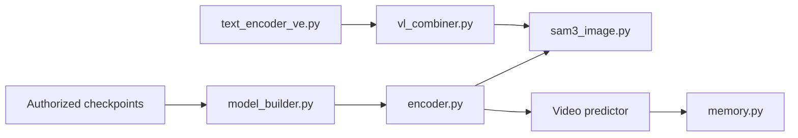

# facebookresearch/sam3

> Modèle de segmentation d'images et vidéos guidé par texte ou exemples, pour vision par ordinateur.

## Le problème
Segmenter « tous les objets correspondant à un concept » (ex. « joueur en blanc ») exigeait un détecteur à vocabulaire fixe ou des clics manuels.

## Ce que ça fait vraiment
Détecteur type DETR conditionné par texte, géométrie ou exemples visuels, et tracker hérité de SAM 2, partageant un encodeur (848 M paramètres).
API image (`Sam3Processor`) renvoyant masques, boîtes et scores ; API vidéo par sessions avec prompts sur n'importe quelle frame.
SAM 3.1 : suivi multiplex de plusieurs objets ; agent optionnel couplant un LLM.
Jeux d'évaluation SA-Co/Gold, Silver, VEval ; code d'entraînement et d'évaluation fourni.

## Comment c'est branché


## Essayer
```bash
conda create -n sam3 python=3.12
conda activate sam3
pip install torch==2.10.0 torchvision --index-url https://download.pytorch.org/whl/cu128
git clone https://github.com/facebookresearch/sam3.git
cd sam3
pip install -e .
jupyter notebook examples/sam3_image_predictor_example.ipynb
```

## Coût et pièges
GPU CUDA 12.6+, Python 3.12, PyTorch 2.7+ ; accès aux checkpoints à demander sur Hugging Face puis `hf auth login`.
Licence non identifiée par GitHub : lire ses clauses avant usage commercial.

## Ce que ce n'est pas
Pas utilisable sans GPU ni sans accord d'accès aux poids.
Encore loin du niveau humain sur les benchmarks vidéo publiés.

## Alternatives
Aucune alternative nommée dans le README (OWLv2, DINO-X, Gemini 2.5 sont des comparaisons de résultats, pas des dépôts).

## Pour toi
À adopter pour tout besoin d'annotation ou de segmentation à vocabulaire ouvert, sous réserve d'une lecture de la licence des poids.
