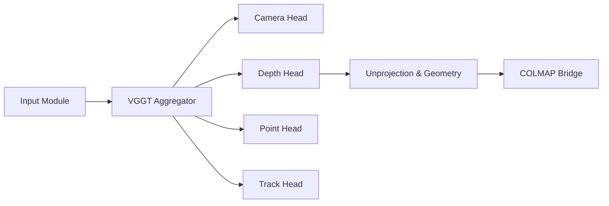

# facebookresearch/vggt

> Transformer feed-forward (CVPR 2025) qui infère caméras, profondeur et nuages de points depuis des vues.

## Le problème
La reconstruction 3D classique (SfM, bundle adjustment) est lente et fragile sur peu d'images.

## Ce que ça fait vraiment
À partir d'une, quelques ou centaines d'images : paramètres caméra, cartes de profondeur, point maps, suivi de points 3D, en secondes.
Têtes séparées (camera, depth, point, track) sur un agrégateur de tokens.
Poids VGGT-1B téléchargés depuis Hugging Face.
Démos Gradio et Viser, export COLMAP compatible Gaussian Splatting (gsplat).

## Comment c'est branché


## Essayer
```bash
git clone git@github.com:facebookresearch/vggt.git
cd vggt
pip install -r requirements.txt
python demo_gradio.py
python demo_colmap.py --scene_dir=/YOUR/SCENE_DIR/ --use_ba
```

## Coût et pièges
GPU CUDA recommandé ; la visualisation 3D peut prendre des dizaines de secondes. Licence à vérifier avant usage commercial.

## Ce que ce n'est pas
Pas un moteur de rendu : il produit la géométrie, le rendu passe par gsplat ou autre. Variantes plus petites non publiées.

## Alternatives
Aucune alternative nommée comme dépôt ; le README compare en monoculaire à DepthAnything v2 et MoGe.

## Pour toi
À surveiller si tu touches à la vision 3D : modèle de référence récent, mais licence à clarifier avant tout produit.
