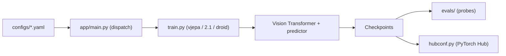

# facebookresearch/vjepa2

> Code officiel de Meta pour V-JEPA 2 : modèles vidéo auto-supervisés et modèle du monde pour la robotique.

## Le problème
Apprendre des représentations vidéo sans étiquettes, puis les réutiliser pour reconnaître des actions, répondre à des questions sur la vidéo ou planifier des gestes de robot.

## Ce que ça fait vraiment
Un encodeur Vision Transformer et un prédicteur apprennent en prédisant des tokens masqués dans l'espace latent. Le dépôt fournit l'entraînement (V-JEPA 2, 2.1, et V-JEPA 2-AC conditionné par l'action sur trajectoires DROID), l'évaluation par sondes d'attention sur backbone gelé, des checkpoints, et un export PyTorch Hub / Hugging Face. Le lancement local ou SLURM passe par `app/main.py` et `evals/main.py`.

## Comment c'est branché


## Essayer
```bash
conda create -n vjepa2-312 python=3.12
conda activate vjepa2-312
pip install .
python -m notebooks.vjepa2_demo
```

## Coût et pièges
GPU CUDA indispensable ; `decord` ne fonctionne pas sous macOS. Les poids sont à télécharger séparément (Meta ou Hugging Face) et le pré-entraînement suppose un cluster SLURM.

## Ce que ce n'est pas
Pas un produit prêt à brancher : c'est du code de recherche. La robotique demande un robot Franka et des données DROID.

## Alternatives
Aucune alternative nommée dans le README.

## Pour toi
À surveiller : les backbones vidéo via PyTorch Hub ou Hugging Face sont directement réutilisables pour des extractions de features ; le pré-entraînement complet dépasse la plupart des budgets.
