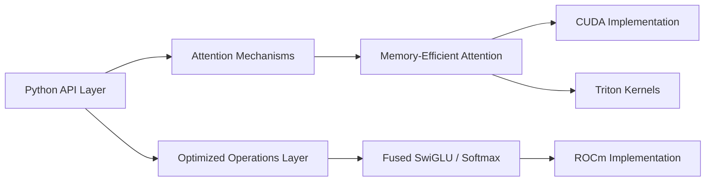

# facebookresearch/xformers

> Blocs Transformer optimisés (attention mémoire-efficace, noyaux fusionnés) pour PyTorch sur GPU.

## Le problème
L'attention standard sature la mémoire GPU et ralentit l'entraînement et l'inférence des Transformers.

## Ce que ça fait vraiment
`xformers.ops.memory_efficient_attention` : attention exacte, jusqu'à 10x plus rapide annoncé.
Attention sparse et block-sparse, softmax, linear, layer norm, dropout et SwiGLU fusionnés.
Noyaux CUDA propres, avec dispatch vers Triton, CUTLASS ou Flash-Attention quand c'est pertinent.
Roues pip pour CUDA 12.6/12.8/13.0, ROCm expérimental ; `python -m xformers.info` liste les noyaux dispos.

## Comment c'est branché


## Essayer
```bash
pip3 install -U xformers --index-url https://download.pytorch.org/whl/cu128
python -m xformers.info
```

## Coût et pièges
GPU requis ; version liée à PyTorch (2.10.0 pour la stable). Build depuis les sources : des dizaines de minutes. Licence non reconnue par GitHub, à vérifier.

## Ce que ce n'est pas
Pas un framework de modèles complet : des briques à insérer dans ton code PyTorch. Le support ROCm est expérimental.

## Alternatives
- Flash-Attention : noyau d'attention que xFormers sait déjà appeler.
- Triton : pour écrire tes propres noyaux fusionnés.

## Pour toi
À adopter : dépendance standard des piles diffusion et LLM, gain mémoire direct sur l'entraînement ; vérifier seulement l'alignement de version avec ton PyTorch.
