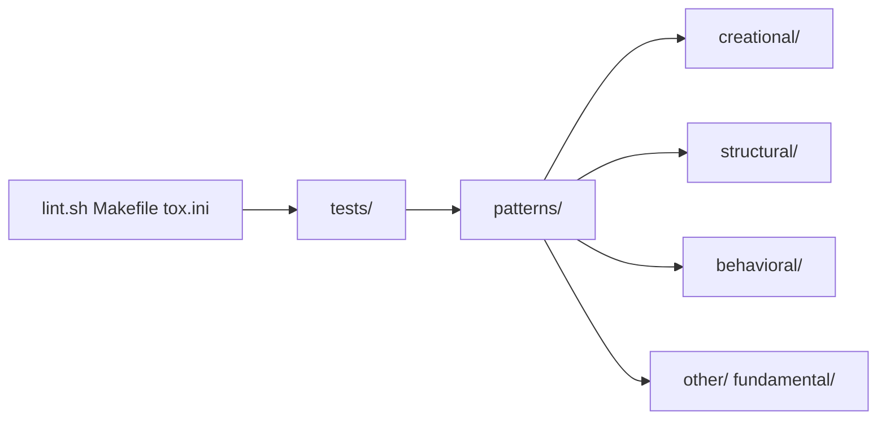

# faif/python-patterns

> Collection de patrons de conception et d'idiomes en Python, avec exemples courts, pour développeurs Python.

## Le problème
Les catalogues de patrons de conception sont écrits pour Java ou C++ ; en Python certains sont superflus et il faut les voir en idiomes locaux.

## Ce que ça fait vraiment
Un module Python par patron, rangés par catégories : création (abstract_factory, builder, pool…), structure (adapter, decorator, facade, proxy…), comportement (observer, strategy, state, command…), testabilité, fondamentaux et autres (blackboard, graph_search, hsm). Une section d'anti-patrons (Singleton, God Object, abus d'héritage) explique pourquoi les éviter. Les tests reprennent l'arborescence.

## Comment c'est branché


## Essayer
```bash
./lint.sh
make lock
```

## Coût et pièges
Gratuit. Licence : aucune déclarée dans le catalogue, donc réutilisation du code juridiquement floue. Le README insiste : chaque patron a ses compromis.

## Ce que ce n'est pas
Pas une bibliothèque à importer ni une autorité : un support d'apprentissage. Le README rappelle de se demander pourquoi choisir un patron plus que comment l'implémenter.

## Alternatives
- Aucune alternative nommée dans le README.

## Pour toi
Adopter comme aide-mémoire de lecture pour structurer du code Python de pipeline, sans copier de code puisque la licence n'est pas déclarée.

