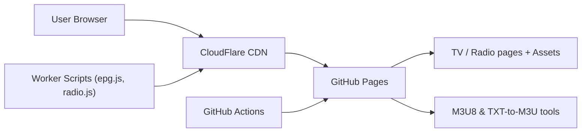

# fanmingming/live

> Bibliothèque de logos de chaînes TV et radio, avec petits outils M3U/EPG hébergés sur GitHub Pages.

## Le problème
Les lecteurs IPTV ont besoin d'icônes de chaînes et de fichiers M3U bien formés, que personne ne tient à jour de façon centralisée.

## Ce que ça fait vraiment
Sert des logos PNG par URL (`/tv/{name}.png`, `/radio/{name}.png`), un guide EPG (`e.xml`) et des outils web : téléchargement m3u8, conversion TXT↔M3U, lecteur M3U8. Le dépôt contient aussi des listes M3U collectées sur Internet, sans garantie de validité. Le projet dit ne stocker aucun flux et laisse la responsabilité légale aux utilisateurs.

## Comment c'est branché


## Essayer
```bash
# Récupérer le fichier exemple mentionné dans le README :
# https://live.fanmingming.cn/tv/m3u/demo.m3u
# puis y remplacer les sources par les vôtres et publier sur GitHub Pages
```

## Coût et pièges
Gratuit. Dépend de domaines et d'un CDN tenus par une personne. L'EPG vient d'un site tiers dont l'exactitude n'est pas garantie.

## Ce que ce n'est pas
Ce n'est pas un service de streaming ni un fournisseur de flux. Les listes du dossier `/m3u/` sont collectées sur Internet et servent, dit le README, « à tester et étudier ».

## Alternatives
- Aucune alternative nommée dans le README.

## Pour toi
Ignorer : ressource IPTV sans rapport avec les données ou l'IA, et dont les listes de flux posent des questions de légalité.

