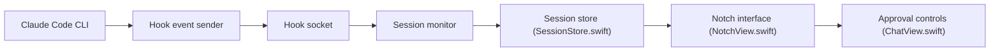

# farouqaldori/claude-island

> Application macOS (Vibe Notch) affichant l'état des sessions Claude Code dans l'encoche de l'écran.

## Le problème
Il faut revenir au terminal pour savoir si Claude Code attend une autorisation.

## Ce que ça fait vraiment
Des hooks installés dans `~/.claude/hooks/` envoient les événements par socket Unix ; l'app suit plusieurs sessions, analyse les fichiers de conversation, affiche l'historique en Markdown et permet d'approuver ou refuser un outil depuis l'encoche (via tmux). L'installation des hooks est automatique au premier lancement.

## Comment c'est branché


## Essayer
```bash
xcodebuild -scheme ClaudeIsland -configuration Release build
```

## Coût et pièges
Gratuit ; macOS 15.6+ et Claude Code CLI. Télémétrie Mixpanel anonyme (lancement, version, démarrage de session).

## Ce que ce n'est pas
Pas un outil multiplateforme ni utile hors Mac avec encoche. Il modifie tes hooks Claude.

## Alternatives
Aucune alternative nommée dans le README.

## Pour toi
À ignorer pour un profil data/MLOps : gadget de confort réservé aux Mac, avec télémétrie, sans valeur pour tes pipelines.

