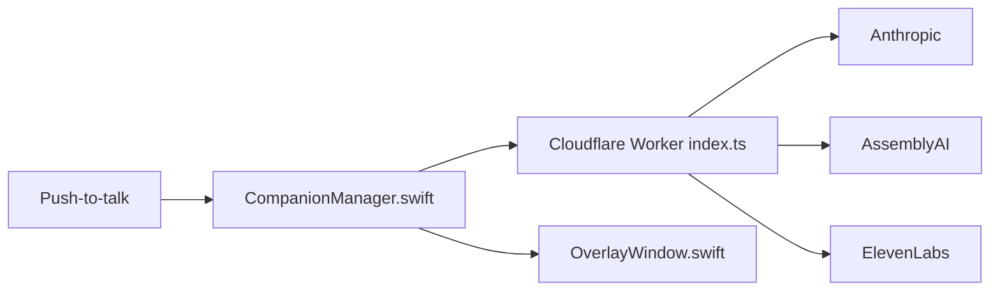

# farzaa/clicky

> Compagnon IA macOS près du curseur : voit l'écran, parle et pointe des éléments.

## Le problème
Apprendre un logiciel oblige à basculer entre l'app et un chat sans contexte d'écran.

## Ce que ça fait vraiment
App de barre de menus : touche push-to-talk, transcription AssemblyAI, capture d'écran envoyée à Claude en streaming, réponse lue par ElevenLabs. Claude peut insérer des balises `[POINT:x,y:label:screenN]` pour déplacer le curseur. Les trois API passent par un Worker Cloudflare qui garde les clés. L'auteur a repris le développement en privé (avril 2026).

## Comment c'est branché


## Essayer
```bash
cd worker && npm install
npx wrangler secret put ANTHROPIC_API_KEY
npx wrangler secret put ASSEMBLYAI_API_KEY
npx wrangler secret put ELEVENLABS_API_KEY
npx wrangler deploy
open leanring-buddy.xcodeproj
```

## Coût et pièges
Trois clés d'API payantes, compte Cloudflare, macOS 14.2+, Xcode 15+. Permissions micro, accessibilité et enregistrement d'écran. Le code contient `ClickyAnalytics.swift` (télémétrie probable).

## Ce que ce n'est pas
Le README dit que le code ouvert est figé : les nouveautés restent privées.

## Alternatives
Aucune alternative nommée dans le README.

## Pour toi
Surveiller : bon exemple d'architecture voix+écran+LLM derrière un proxy, mais dépôt figé et coûts d'API.

