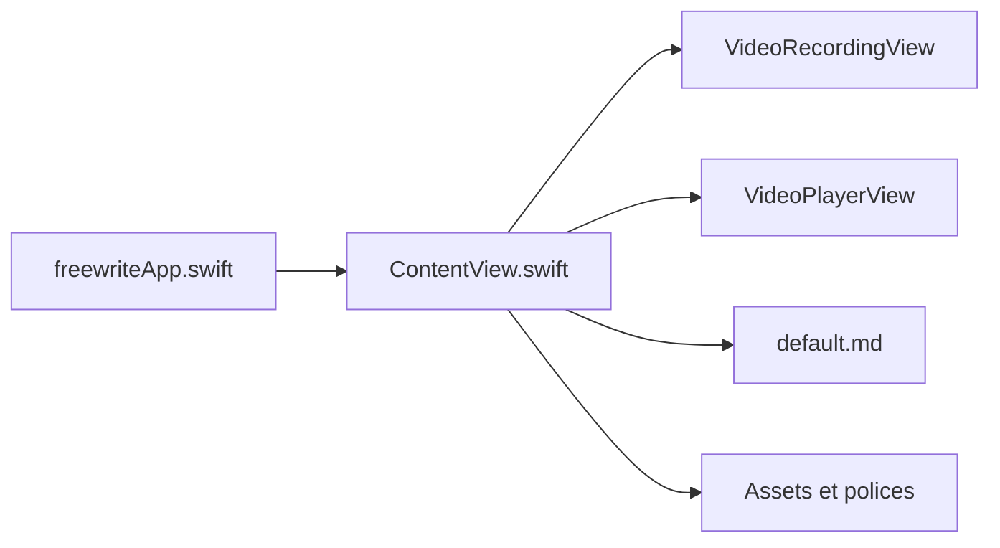

# farzaa/freewrite

> Petite app Mac open source pour écrire au fil de la plume, à cloner et à remixer.

## Le problème
Écrire sans se censurer demande un outil sans distraction.

## Ce que ça fait vraiment
README de quelques lignes : cloner, ouvrir dans Xcode, compiler. D'après le code, une app SwiftUI locale sans serveur ni base ; elle embarque une police et un texte par défaut, plus des vues d'enregistrement et de lecture vidéo dont le rôle n'est pas décrit.

## Comment c'est branché

## Essayer
Aucune commande : le README décrit trois étapes (cloner le dépôt, l'ouvrir dans Xcode, cliquer sur Build).

## Coût et pièges
Xcode et un Mac requis. Les droits d'accès vidéo (entitlements) ne sont pas expliqués. Le mainteneur compile lui-même les versions à partir des PR.

## Ce que ce n'est pas
Pas une application multiplateforme ni un outil de prise de notes structurées. La description de l'architecture est en partie déduite des noms de fichiers.

## Alternatives
Aucune alternative nommée dans le README.

## Pour toi
Ignorer : outil d'écriture personnel pour Mac, sans lien avec la data ou l'IA, README trop maigre pour aller plus loin.

