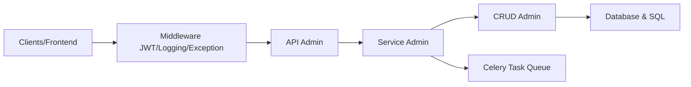

# fastapi-practices/fastapi_best_architecture

> Squelette de backend FastAPI en pseudo trois couches (api, service, crud) pour projets Python d'entreprise.

## Le problème
Un projet FastAPI sans structure imposée dérive vite ; les équipes venues de Java ou Django cherchent une organisation familière.

## Ce que ça fait vraiment
Le README est très court : il ne fait que mettre en correspondance les couches Java et celles du projet (api = controller, schema = dto, service, crud = dao, model). D'après le code : modules admin, generator et task, authentification JWT et OAuth2, contrôle d'accès Casbin, tâches asynchrones Celery, plugins (Casbin, notifications), bases MySQL ou PostgreSQL, Redis, déploiement Docker.

## Comment c'est branché


## Essayer
Aucune commande dans le README, qui renvoie à la documentation officielle.
```bash
# non documenté dans le README
```

## Coût et pièges
Gratuit ; il faut une base SQL, Redis et un worker Celery pour profiter de l'ensemble. La documentation détaillée est hors dépôt.

## Ce que ce n'est pas
Pas un framework : un modèle de projet à cloner et adapter. Le README ne décrit ni installation ni fonctionnalités : ces éléments viennent de l'analyse du code.

## Alternatives
Aucune alternative nommée dans le README.

## Pour toi
À surveiller : un point de départ pertinent pour exposer un modèle en API avec authentification et tâches de fond, mais lis la documentation externe avant de t'y engager, le README ne prouve rien.
