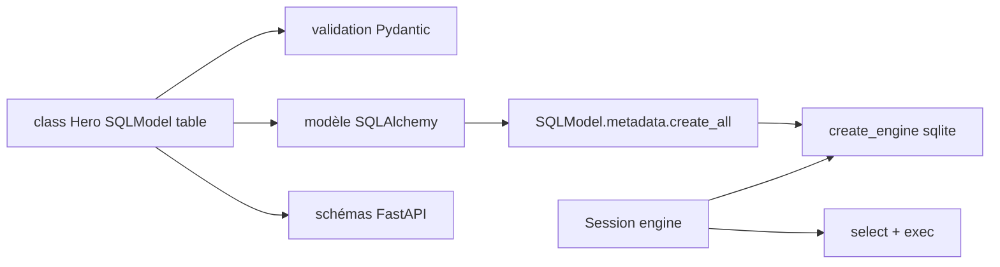

# fastapi/sqlmodel

> Couche fine sur Pydantic et SQLAlchemy pour décrire tables et modèles de données une seule fois.

## Le problème
Dans une application FastAPI, la même entité s'écrit deux fois : modèle SQLAlchemy et schéma Pydantic.
Les deux dérivent, et chaque champ ajouté doit l'être à deux endroits.

## Ce que ça fait vraiment
Une classe `Hero(SQLModel, table=True)` est à la fois un modèle SQLAlchemy et un modèle Pydantic.
Les attributs annotés deviennent les colonnes ; `Field(default=None, primary_key=True)` porte les détails SQL.
`create_engine`, `Session`, `session.add`, `session.commit` restent les gestes SQLAlchemy habituels.
Les requêtes passent par `select(Hero).where(...)` puis `session.exec(statement).first()`.

## Comment c'est branché


## Essayer
```bash
uv add sqlmodel
```
Puis définir la classe, `engine = create_engine("sqlite:///database.db")`, `SQLModel.metadata.create_all(engine)`,
et écrire dans un `with Session(engine) as session:`.

## Coût et pièges
Pydantic et SQLAlchemy sont installés avec ; leurs versions et leurs ruptures deviennent les tiennes.
`pip` fonctionne aussi, mais le README l'impose dans un environnement virtuel.

## Ce que ce n'est pas
Pas un ORM nouveau : c'est une couche fine, la puissance et les pièges de SQLAlchemy restent dessous.
Pas un outil de migration : rien sur les évolutions de schéma dans le README.
Pas limité à FastAPI, même si c'est le cas d'usage qui l'a motivé.

## Alternatives
`SQLAlchemy` seul — si tu n'as pas besoin de la validation Pydantic côté API.

## Pour toi
Le raccourci évident dès que tu exposes des données SQL derrière FastAPI : un modèle au lieu de deux.
