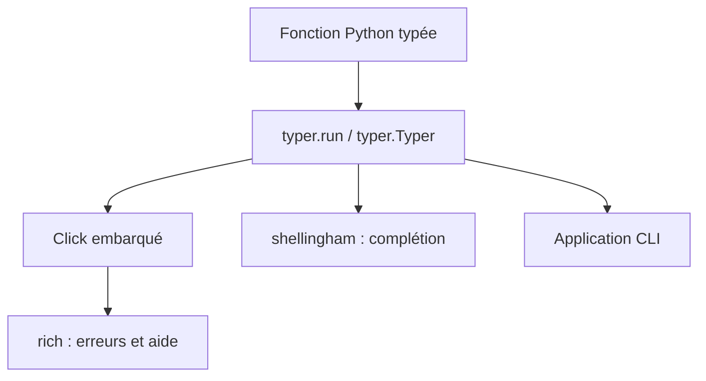

# fastapi/typer

> Bibliothèque Python qui transforme des fonctions typées en applications en ligne de commande, pour développeurs Python.

## Le problème
Écrire une CLI avec argparse ou similaire demande beaucoup de code répétitif : options, aide, complétion, validation.

## Ce que ça fait vraiment
Tu déclares les paramètres comme des arguments de fonction avec des types Python ; Typer en déduit options, arguments, aide (`--help`) et complétion shell (Bash, Zsh, Fish, PowerShell). Il gère les sous-commandes via `typer.Typer()`. La commande `typer` peut aussi lancer un script sans Typer en le convertissant en CLI. Depuis la 0.26.0, le code de Click est embarqué au lieu d'être une dépendance.

## Comment c'est branché


## Essayer
```bash
uv add typer
typer main.py run
uv run python main.py hello Camila
```

## Coût et pièges
Gratuit. Le README signale que certaines fonctionnalités de Click ne resteront pas disponibles. `typer-slim` n'existe plus en version allégée.

## Ce que ce n'est pas
Ce n'est pas un framework d'application complet : uniquement des interfaces en ligne de commande.

## Alternatives
Click : la base historique, plus explicite ; le README note que Typer l'a intégré en interne.

## Pour toi
À adopter : idéal pour outiller scripts d'entraînement, d'évaluation ou de déploiement en Python avec très peu de code.

