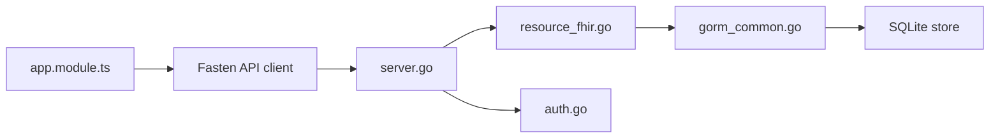

# fastenhealth/fasten-onprem

> Dossier médical personnel auto-hébergé pour visualiser des données de santé FHIR en famille.

## Le problème
L'historique médical est éparpillé entre cliniques, labos et assureurs, et on ne veut pas le confier à un tiers.

## Ce que ça fait vraiment
Application web auto-hébergée (API Go, interface Angular, SQLite ou PostgreSQL) : on saisit des données ou on importe des bundles FHIR exportés ailleurs, puis on consulte tableaux de bord et historique. Le README précise qu'elle ne se connecte pas directement aux fournisseurs de soins (c'est le produit commercial Fasten Connect). Multi-utilisateur annoncé comme chantier en cours ; HTTPS avec autorité de certification auto-générée.

## Comment c'est branché


## Essayer
```bash
curl https://raw.githubusercontent.com/fastenhealth/fasten-onprem/refs/heads/main/docker-compose-prod.yml -o docker-compose.yml
curl https://raw.githubusercontent.com/fastenhealth/fasten-onprem/refs/heads/main/set_env.sh -o set_env.sh
chmod +x ./set_env.sh && ./set_env.sh
docker compose up -d
```

## Coût et pièges
Gratuit. Docker requis ; certificat auto-signé à importer dans le navigateur. Le compte d'exemple `testuser` est cité dans le README.

## Ce que ce n'est pas
Pas un agrégateur automatique de dossiers hospitaliers, ni une solution de sécurité forte : l'administrateur voit tous les enregistrements. Le dépôt est archivé.

## Alternatives
OpenEMR (cité comme système pour cliniques, non familial).

## Pour toi
À ignorer : dépôt archivé, GPL-3.0, et sans import direct des prestataires, il ne tient pas la promesse d'agrégation.

