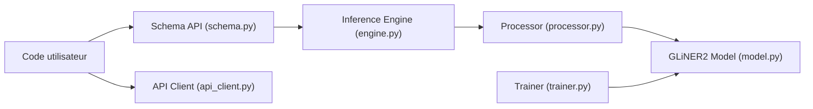

# fastino-ai/GLiNER2

> Modèles encodeurs locaux pour extraire entités, classes, relations et JSON structuré via un schéma unique.

## Le problème
Extraire des entités, classer du texte et remplir des structures JSON exige d'ordinaire plusieurs modèles ou un LLM coûteux à chaque appel.

## Ce que ça fait vraiment
Un schéma décrit ce qu'on veut (entités, classification, structures, relations, attributs de span) et un seul modèle encodeur (DeBERTa, 74 M à 340 M de paramètres) répond en une passe. Fonctionne sur CPU, en local. Deux architectures (span, boundary) derrière `AutoExtractor`. Entraînement et LoRA inclus. Un client API vers le service hébergé existe en option.

## Comment c'est branché


## Essayer
```bash
pip install gliner2
pip install gliner2[train]
pip install "gliner2[local]"
```
```python
from gliner2 import AutoExtractor
model = AutoExtractor.from_pretrained("fastino/gliner2.5-base-v1")
model.extract_entities("Apple CEO Tim Cook announced iPhone 15 in Cupertino yesterday.", ["company", "person", "product", "location"])
```

## Coût et pièges
Local gratuit, CPU suffisant ; GPU optionnel (fp16, FlashDeBERTa). L'API cloud demande une clé `PIONEER_API_KEY`. `GLiNER2.from_pretrained` ne charge pas les checkpoints boundary.

## Ce que ce n'est pas
Pas un LLM génératif : il extrait des spans présents dans le texte. Les exemples de sortie du README sont illustratifs, la précision réelle dépend de ton domaine.

## Alternatives
GLiNER, l'architecture d'origine citée dans le README.

## Pour toi
À adopter : extraction et classification locales, sans GPU ni facture par appel, avec fine-tuning LoRA ; idéal pour pipelines de données textuelles.

