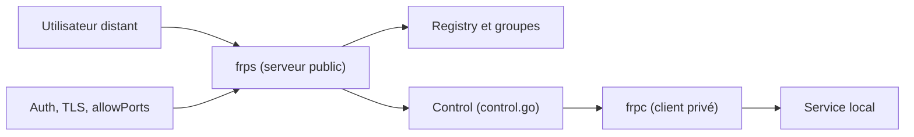

# fatedier/frp

> Proxy inverse qui expose un service local situé derrière un NAT ou un pare-feu sur Internet.

## Le problème
Un serveur sans IP publique (poste de dev, machine GPU en LAN) n'est pas joignable de l'extérieur sans ouvrir des ports ou monter un VPN.

## Ce que ça fait vraiment
Deux binaires : `frps` sur une machine à IP publique, `frpc` sur la machine privée. Le client ouvre une connexion de contrôle vers le serveur, puis les proxys TCP, UDP, HTTP, HTTPS, tcpmux, STCP (clé partagée) et XTCP (P2P) relaient le trafic. Options : tableau de bord, Prometheus, authentification par jeton ou OIDC, TLS activé par défaut, limitation de bande passante, plugins et passerelle SSH.

## Comment c'est branché


## Essayer
```bash
./frps -c ./frps.toml
./frpc -c ./frpc.toml
ssh -oPort=6000 test@x.x.x.x
```
Avec `bindPort = 7000` côté serveur, puis `serverAddr`, `serverPort` et un proxy `type = "tcp"` côté client (exemple du README).

## Coût et pièges
Gratuit, mais il faut une machine à IP publique. Le README signale que des antivirus classent `frpc` comme malware. Son exemple de tableau de bord utilise admin/admin : à changer. Exposer un port SSH sur Internet demande un jeton, TLS et `allowPorts`. La version 2 est annoncée incompatible avec la v1.

## Ce que ce n'est pas
Ni un VPN complet (VirtualNet est une fonction alpha), ni un service géré. Le développement dépend d'une personne disponible à temps partiel.

## Alternatives
- gofrp/tiny-frpc : client léger d'environ 3,5 Mo pour appareils à ressources limitées.
- gofrp/plugin : dépôt de plugins pour étendre frp.

## Pour toi
À adopter : donne accès à un notebook ou une machine GPU chez soi via un serveur public, à condition d'activer jeton et TLS.

