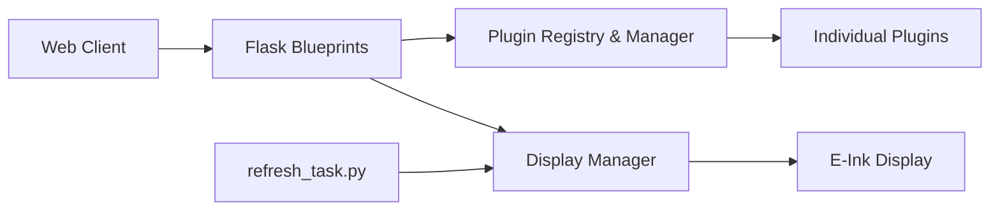

# fatihak/InkyPi

> Écran e-ink sur Raspberry Pi piloté par une interface web, avec des plugins pour afficher météo, agenda ou images.

## Le problème
Afficher des informations sans écran lumineux, sans notifications ni bruit, sur un cadre e-ink configurable depuis n'importe quel appareil du réseau.

## Ce que ce n'est pas
Voir plus bas. D'abord, le fonctionnement.

## Ce que ça fait vraiment
Une application Python (blueprints style Flask) démarre via `inkypi.py`, sert une interface web, charge des plugins listés dans un registre (horloge, météo, agenda, journal/BD, upload d'image, IA texte/image via OpenAI) et rafraîchit l'écran par une tâche planifiée via un display manager. Des playlists planifient les plugins par horaires. Les scripts d'installation activent SPI et I2C.

## Comment c'est branché


## Essayer
```bash
git clone https://github.com/fatihak/InkyPi.git
cd InkyPi
sudo bash install/install.sh
sudo bash install/update.sh
```

## Coût et pièges
Matériel : Raspberry Pi (4, 3 ou Zero 2 W), carte microSD, écran Inky ou Waveshare (certains modèles IT8951 non supportés). Le plugin IA utilise les modèles OpenAI : clé et facture à votre charge. Liens d'affiliation dans le README.

## Ce que ce n'est pas
Pas un produit clé en main : c'est un projet de bricoleur, avec des problèmes connus sur Pi Zero W. Le plugin IA n'est qu'un plugin parmi d'autres.

## Alternatives
Aucune alternative nommée dans le README.

## Pour toi
À ignorer : projet matériel de loisir, sans rapport avec les pipelines data ou IA, sauf si tu veux un tableau de bord e-ink personnel.

