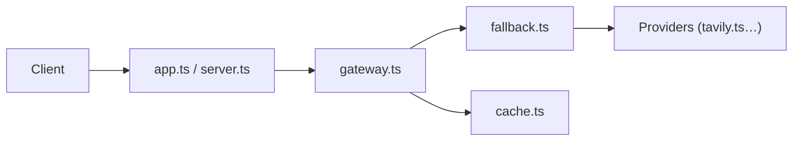

# fatwang2/search2ai

> Passerelle de recherche auto-hébergée, compatible Perplexity, avec bascule entre fournisseurs, pour agents IA.

## Le problème
Chaque API de recherche a son schéma et ses limites ; quand l'une tombe, l'agent n'a plus de recherche.

## Ce que ça fait vraiment
Normalise `search`, `news` et `crawl` en un schéma (`title/url/snippet/date`). Essaie les fournisseurs configurés dans l'ordre (Search1API, Tavily, Brave, Exa, Serper, SerpApi, Google, SearXNG, Jina, Firecrawl) et bascule sur erreur, limite ou délai, en indiquant les fournisseurs sautés. Utilisable en bibliothèque, serveur HTTP, serveur MCP, Cloudflare Workers ou Docker. Ancien proxy de chat avec outils de recherche conservé en option.

## Comment c'est branché


## Essayer
```bash
npm i search2ai
SEARCH1API_KEY=your_key npx search2ai serve
curl http://localhost:3014/v1/search -H 'Content-Type: application/json' -d '{"query": "latest node.js lts", "max_results": 3}'
```

## Coût et pièges
Une clé par fournisseur utilisé (« apportez votre clé »). Search1API, service des mêmes auteurs, est placé en tête de chaîne par défaut. Les résultats vides ne déclenchent pas la bascule sauf `FALLBACK_ON_EMPTY=true`.

## Ce que ce n'est pas
Pas un moteur ni un scraper sans clé. La fiabilité avancée (rotation de clés, coupe-circuit) est en feuille de route v0.4.

## Alternatives
Aucune alternative nommée dans le README.

## Pour toi
À surveiller : utile pour fiabiliser la recherche d'un agent via MCP ou HTTP ; mainteneur unique et fournisseur maison favorisé.

