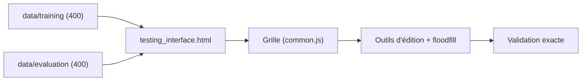

# fchollet/ARC-AGI

> Jeu de tâches ARC-AGI-1 et interface web pour les résoudre à la main ; pour chercheurs en raisonnement IA.

## Le problème
Mesurer une forme d'intelligence fluide demande un benchmark de tâches inédites, résolu avec peu d'exemples.

## Ce que ça fait vraiment
Le dépôt contient 400 tâches d'entraînement et 400 d'évaluation au format JSON : chaque tâche a des paires `train` (démonstrations) et `test`, avec des grilles de 1x1 à 30x30 d'entiers 0 à 9. Une interface HTML (`apps/testing_interface.html`) permet de charger une tâche, éditer la grille (redimensionner, copier, sélection, remplissage) et valider : seule la grille exacte compte, 3 essais en principe (non imposés par l'interface).

## Comment c'est branché


## Essayer
```bash
# Aucune commande : ouvrir apps/testing_interface.html dans un navigateur
# (Chrome recommandé) et charger un fichier de tâche JSON.
```

## Coût et pièges
Gratuit, sans dépendance. Ne pas regarder ni optimiser sur l'ensemble d'évaluation pendant le développement, sous peine de fuite. Dernier push d'avril 2025.

## Ce que ce n'est pas
C'est la version 1 du benchmark ; le README renvoie à un dépôt ARC-AGI-2. Pas un solveur ni un classement.

## Alternatives
ARC-AGI-2 (dépôt séparé mentionné dans le README).

## Pour toi
Utile pour tester le raisonnement d'un LLM ou d'un synthétiseur de programmes sur un benchmark connu ; pour du travail récent, regarde plutôt la version 2.

