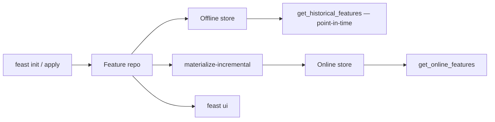

# feast-dev/feast

> Feature store open source : mêmes features à l'entraînement et en inférence temps réel.

## Le problème
Les features calculées pour l'entraînement et celles servies en production divergent, et les
jointures temporelles maison laissent fuiter des valeurs futures dans le jeu d'entraînement.

## Ce que ça fait vraiment
Trois composants articulés : un *offline store* pour l'historique (entraînement, scoring batch),
un *online store* à faible latence pour la prédiction temps réel, et un serveur de features pour
exposer les valeurs précalculées. `get_historical_features` produit des jeux corrects
point-in-time, ce qui supprime la fuite de données. `materialize-incremental` pousse les valeurs
vers l'online store, `get_online_features` les relit par entité. Une couche d'accès unique
découple le stockage de la récupération, donc le modèle reste portable d'une infra à l'autre.

## Comment c'est branché


## Essayer
```bash
pip install feast
feast init my_feature_repo
cd my_feature_repo/feature_repo
feast apply
feast ui
feast materialize-incremental $(date -u +"%Y-%m-%dT%H:%M:%S")
feast materialize --disable-event-timestamp
```

## Coût et pièges
La bibliothèque est gratuite ; les stores derrière ne le sont pas nécessairement — la config
minimale locale diffère beaucoup d'un déploiement Snowflake, GCP ou AWS, renvoyé à une page à
part. L'interface web `feast ui` est marquée **expérimentale**. `--disable-event-timestamp` prend
l'heure courante comme timestamp : pratique quand la source n'en a pas, mais cela invalide la
correction point-in-time.

## Ce que ce n'est pas
Ce n'est pas un moteur de calcul de features : il orchestre et sert, il ne transforme pas tes
données à ta place. Ce n'est pas une base de données — il s'appuie sur les tiennes.

## Alternatives
Aucune alternative nommée dans le README.

## Pour toi
La brique canonique du MLOps tabulaire : à adopter dès que training et serving se désynchronisent.
