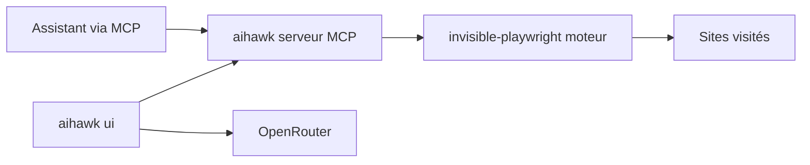

# feder-cr/Jobs_Applier_AI_Agent

> Navigateur anti-détection piloté par agent, avec serveur MCP, pour automatiser le web sans blocage.

## Le problème
Les agents qui pilotent un navigateur se font bloquer (captchas, détection de bots) sur les sites qui n'ont pas d'API.

## Ce que ça fait vraiment
Le README actuel présente AIHawk comme un navigateur furtif (moteur Firefox) et un agent web : soit un serveur MCP pour Claude Code, Codex ou Gemini CLI, soit une interface web locale (port 8765) avec une clé OpenRouter. Options : proxy, graine d'identité, profil persistant. Le dépôt s'appelait à l'origine un agent de candidature automatique ; le diagramme fourni décrit encore cet ancien outil (main.py, YAML, résumés/lettres), ce qui contredit le README.

## Comment c'est branché


## Essayer
```bash
curl -LsSf https://astral.sh/uv/install.sh | sh
uvx invisible-playwright fetch
claude mcp add --scope user stealth -- uvx aihawk
```
```bash
uvx aihawk ui --openrouter-key sk-or-...
```

## Coût et pièges
Clé OpenRouter à ta charge. Chaque lancement récupère un fichier compteur sur GitHub (IP visible). L'interface n'a pas d'authentification si on change l'hôte. La clé passée en argument reste dans l'historique shell.

## Ce que ce n'est pas
Pas l'agent de candidature décrit par l'ancien diagramme. L'intitulé « sans blocage » n'est pas une garantie : le README rappelle de respecter les conditions des sites.

## Alternatives
Le README renvoie à un comparatif wiki avec browser-use et les agents de type Operator, sans détail lu ici.

## Pour toi
À ignorer pour l'instant : usage centré sur le contournement de détection, mainteneur unique et dépôt dont l'identité a changé ; si tu as besoin d'automatisation web, préfère un outil au périmètre clair.
