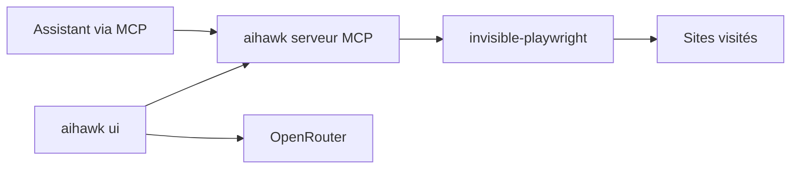

# feder-cr/Jobs_Applier_AI_Agent_AIHawk

> Même projet que le dépôt précédent : navigateur furtif piloté par agent, avec serveur MCP.

## Le problème
Les agents qui pilotent un navigateur se font bloquer par les sites sans API (captchas, détection de bots).

## Ce que ça fait vraiment
README strictement identique à celui de `feder-cr/Jobs_Applier_AI_Agent` (mêmes étoiles, même date de création, mêmes issues) : il s'agit du même dépôt sous un autre nom. AIHawk sert un moteur Firefox furtif via un serveur MCP ou une interface locale sur le port 8765 avec une clé OpenRouter. Le diagramme fourni décrit l'ancien outil de candidature (main.py, config.py, llm_manager, resume_and_cover_builder), en contradiction avec le README.

## Comment c'est branché


## Essayer
```bash
uvx invisible-playwright fetch
codex mcp add stealth -- uvx aihawk
```
```bash
uvx aihawk ui --openrouter-key sk-or-...
```

## Coût et pièges
Clé OpenRouter à ta charge ; un fichier compteur est téléchargé à chaque lancement (l'IP est visible de GitHub) ; interface sans authentification si l'hôte est modifié.

## Ce que ce n'est pas
Pas un deuxième projet : doublon du précédent. Pas l'ancien agent de candidature, malgré le nom du dépôt.

## Alternatives
Comparatif wiki cité (browser-use, agents de type Operator), non détaillé.

## Pour toi
À ignorer : doublon d'un dépôt déjà écarté, centré sur le contournement de détection, avec un mainteneur unique.
