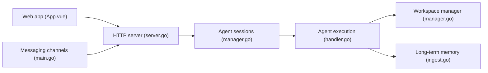

# felinics/Memoh

> Plateforme multi-agents où chaque agent a son poste de travail cloud persistant avec mémoire.

## Le problème
Les agents restent liés à ton ordinateur et oublient le contexte entre plateformes et sessions.

## Ce que ça fait vraiment
Chaque agent dispose d'un espace de travail isolé (fichiers, bureau, navigateur, réseau) géré par un runtime de conteneurs, avec mémoire longue, tâches planifiées, outils MCP et connecteurs. Tu les joins par Telegram, Discord, Lark, WeChat ou l'interface web. Agent intégré avec tes clés, ou Claude Code et Codex hébergés. Sous-projets : Twilight AI (SDK Go), Connect It, UI.

## Comment c'est branché


## Essayer
```bash
curl -fsSL https://memoh.sh | sh
```
```bash
git clone --depth 1 --recurse-submodules --shallow-submodules https://github.com/felinics/Memoh.git
cd Memoh
cp conf/app.docker.toml config.toml
export MEMOH_INTERNAL_RPC_SHARED_SECRET="$(openssl rand -hex 32)"
docker compose up -d
```

## Coût et pièges
Auto-hébergé : tes clés d'API et ton serveur ; Memoh Cloud (app.memoh.net) en alternative avec compte. Le secret RPC interne doit rester identique à chaque recréation. La section « Project Status » est vide dans le README.

## Ce que ce n'est pas
Pas un simple chatbot : il orchestre des machines persistantes, donc une surface d'attaque large. Licence AGPL-3.0.

## Alternatives
Aucune alternative nommée dans le README.

## Pour toi
À surveiller : intéressant pour des agents toujours actifs, mais jeune (janvier 2026) et lourd à sécuriser.

