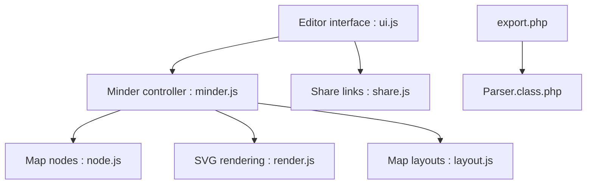

# fex-team/kityminder

> Éditeur de cartes mentales en ligne basé sur SVG, issu de l'équipe FEX de Baidu.

## Le problème
Éditer des cartes mentales dans le navigateur avec une expérience proche d'un outil natif.

## Ce que ça fait vraiment
Application web SVG : édition de nœuds, mises en page, connecteurs, import/export (MindManager, XMind via un export PHP), partage par lien et synchronisation cloud via le service en ligne de Baidu. Le README déconseille de partir de ce dépôt pour du développement.

## Comment c'est branché


## Essayer
```bash
git clone https://github.com/fex-team/kityminder.git
git submodule init && git submodule update
npm install
bower install
grunt
```

## Coût et pièges
Gratuit. Chaîne de build ancienne (bower, grunt, sous-modules). Dernier push en 2019. Le cloud et le partage reposent sur naotu.baidu.com.

## Ce que ce n'est pas
Pas la brique recommandée : le README oriente vers kityminder-core (visualisation) et kityminder-editor (édition).

## Alternatives
- kityminder-core : pour la visualisation de cartes.
- kityminder-editor : pour l'édition intégrée.

## Pour toi
À ignorer : dépôt inactif depuis 2019, dont l'auteur lui-même redirige vers d'autres modules.

