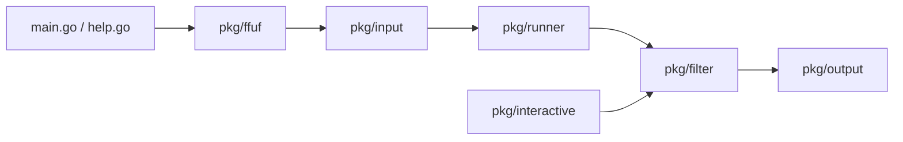

# ffuf/ffuf

> Outil Go en ligne de commande qui teste en masse des URL, en-têtes ou paramètres web à partir de listes de mots.

## Le problème
Vérifier quelles ressources, hôtes virtuels ou paramètres un serveur web accepte suppose d'envoyer un grand nombre de requêtes variées et de trier les réponses.

## Ce que ça fait vraiment
Le mot-clé `FUZZ`, placé dans l'URL, les en-têtes ou le corps d'une requête, est remplacé par chaque entrée d'une liste de mots. Les réponses sont retenues ou écartées selon des critères (code HTTP, taille, lignes, mots, regexp, temps). Le programme lance 40 fils en parallèle par défaut, calibre automatiquement les filtres, accepte un mutateur externe et propose un mode interactif pour reconfigurer les filtres en cours d'exécution. Sorties : JSON, HTML, CSV, Markdown.

## Comment c'est branché


## Essayer
```bash
go install github.com/ffuf/ffuf/v2@latest
ffuf -w /path/to/wordlist -u https://target/FUZZ -maxtime 60
```

## Coût et pièges
Gratuit, MIT. Binaires précompilés, Scoop, Winget, Homebrew ou Go 1.20+. Le débit par défaut (40 fils) peut charger fortement une cible : `-rate` et `-p` permettent de le limiter. Un build local affiche le commit et non le tag ; seuls les binaires de la page des releases font foi.

## Ce que ce n'est pas
Ce n'est pas un outil à lancer contre des services qu'on n'est pas autorisé à tester : le volume de requêtes est comparable à une attaque. Le README présente un exercice légal : ffufme (conteneur local) et ffuf.me. Ce n'est pas un outil de test de charge ni un scanner de vulnérabilités.

## Alternatives
- Radamsa : mutateur externe branchable, non un concurrent.

## Pour toi
À ignorer : outil de test d'intrusion web sans rapport avec un flux data/IA, à ne garder que si tu audites toi-même des applications web dont tu as la charge.

