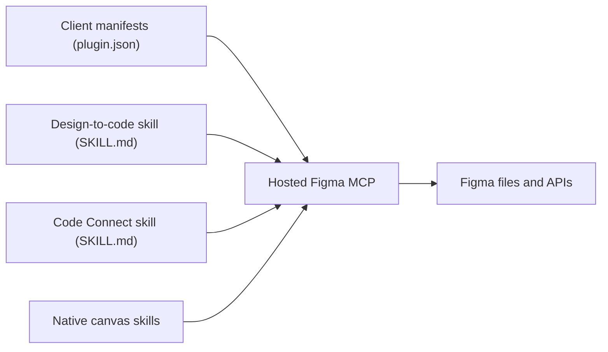

# figma/mcp-server-guide

> Guide et skills pour connecter le serveur MCP hébergé de Figma à un agent de code.

## Le problème
Un agent de code ne voit pas les designs Figma : il devine composants, tokens et mise en page.

## Ce que ça fait vraiment
Ce dépôt ne contient pas de serveur : c'est de la documentation, des manifestes de plugin (Claude, Cursor, GitHub, Gemini) et des skills Markdown qui pointent vers `https://mcp.figma.com/mcp`. Outils cités : `get_design_context` (React + Tailwind), `get_variable_defs`, `get_screenshot`, `get_metadata`. Skills : design vers code, Code Connect, écriture sur le canvas, FigJam.

## Comment c'est branché


## Essayer
```bash
claude plugin install figma@claude-plugins-official
claude mcp add --transport http figma https://mcp.figma.com/mcp
gemini extensions install https://github.com/figma/mcp-server-guide
```

## Coût et pièges
Compte Figma requis. Limites : 6 appels par mois en plan Starter ou sièges View/Collab ; limites par minute pour les sièges Dev/Full. L'écriture sur le canvas est gratuite en bêta puis payante à l'usage.

## Ce que ce n'est pas
Ce n'est pas le serveur MCP lui-même ni un projet open source réutilisable : aucune licence n'est déclarée. Le dossier `skills-figquery/` duplique largement `skills/`.

## Alternatives
Aucune alternative nommée dans le README.

## Pour toi
À adopter seulement si ton équipe utilise Figma : c'est la voie officielle, mais sans intérêt pour un profil data hors design.
