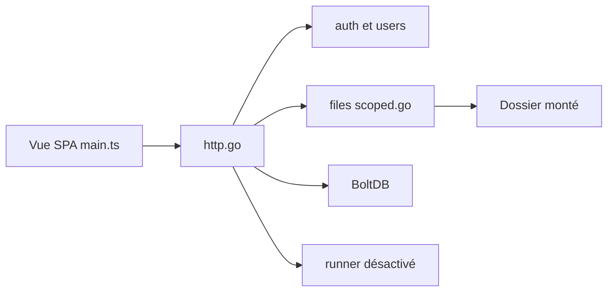

# filebrowser/filebrowser

> Interface web auto-hébergée pour parcourir, envoyer et éditer les fichiers d'un dossier serveur — désormais archivée.

## Le problème
Donner accès à un dossier du serveur depuis un navigateur sans monter un cloud complet.

## Ce que ça fait vraiment
Un serveur Go expose le dossier choisi via une API HTTP (liste, envoi, aperçu, recherche, partage). Une application Vue/TypeScript sert d'interface. Utilisateurs, permissions et règles de chemin sont gérés côté Go, avec stockage BoltDB. Les envois reprenables passent par TUS, avec cache mémoire ou Redis en option. Un exécuteur de commandes existe, désactivé par défaut.

## Comment c'est branché


## Essayer
```bash
# Le README renvoie à la documentation (dossier docs) sans commande d'installation.
# Seule commande citée, pour réactiver l'exécuteur (déconseillé) :
# --disable-exec=false
```

## Coût et pièges
Gratuit, mais archivé le 2026-09-01 : plus de correctifs ni de mises à jour de sécurité. Les sessions JWT ne sont pas révocables et l'exécuteur de commandes équivaut à un shell. Ne pas l'exposer directement à Internet.

## Ce que ce n'est pas
Ce n'est plus un logiciel maintenu : deux familles de failles connues resteront ouvertes. Ce n'est pas un cloud collaboratif complet.

## Alternatives
Aucune alternative nommée dans le README.

## Pour toi
À ignorer pour du nouveau : sans correctifs de sécurité, déployer un accès web aux fichiers de données est un risque inutile.

