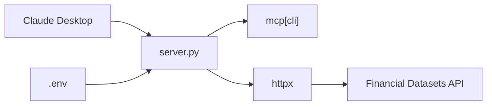

# financial-datasets/mcp-server

> Serveur MCP donnant à Claude l'accès aux états financiers, cours et actualités de Financial Datasets.

## Le problème
Un assistant IA n'a pas de source fiable et structurée pour les états financiers, les cours boursiers ou les prix crypto.

## Ce que ça fait vraiment
Petit serveur Python (`server.py`) qui expose dix outils : compte de résultat, bilan, flux de trésorerie, prix actuel et historique d'actions, actualités d'entreprise, tickers et prix crypto. Chaque outil appelle l'API Financial Datasets via `httpx` avec la clé lue dans `.env`. Sans base de données ni cache visibles.

## Comment c'est branché


## Essayer
```bash
git clone https://github.com/financial-datasets/mcp-server
cd mcp-server
uv venv
source .venv/bin/activate
uv add "mcp[cli]" httpx
cp .env.example .env
uv run server.py
```

## Coût et pièges
Nécessite `FINANCIAL_DATASETS_API_KEY` ; le README ne précise pas les tarifs. Python 3.10+ et uv requis. Config Claude Desktop avec chemins absolus.

## Ce que ce n'est pas
Pas une source de données : c'est un adaptateur vers un service tiers payant ou à quota. Pas de conseil ni d'analyse.

## Alternatives
- Aucune alternative nommée dans le README.

## Pour toi
Surveiller : pratique pour prototyper un agent financier, mais dépendant d'un SaaS et sans mise à jour depuis 2025-06.
