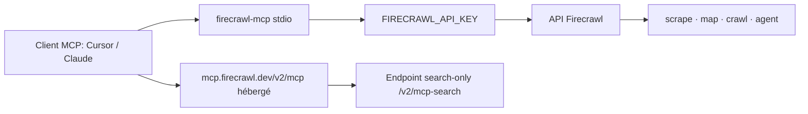

# firecrawl/firecrawl-mcp-server

> Serveur MCP qui donne à un agent la recherche web, le scraping et l'interaction de page.

## Le problème
Un agent qui doit lire le web se heurte au HTML brut, aux reprises, aux limites de débit, et à
des pages qui n'affichent leur contenu qu'après un clic.

## Ce que ça fait vraiment
Expose jusqu'à 25 outils MCP, avec des rôles nettement séparés : `scrape` pour une URL connue,
`map` pour découvrir les URL d'un site sans les charger, `crawl` pour plusieurs pages bornées par
`limit` et `maxDiscoveryDepth`, `search` pour partir d'une requête, `interact` pour cliquer,
taper et naviguer, `parse` pour les fichiers, `agent` pour la recherche multi-sources structurée,
et `monitor_*` pour surveiller une page avec diffs. Le format JSON à schéma est recommandé plutôt
que le markdown, pour ne pas saturer la fenêtre de contexte.

## Comment c'est branché


## Essayer
```bash
env FIRECRAWL_API_KEY=fc-YOUR_API_KEY npx -y firecrawl-mcp
npm install -g firecrawl-mcp
env HTTP_STREAMABLE_SERVER=true FIRECRAWL_API_KEY=fc-YOUR_API_KEY npx -y firecrawl-mcp
export FIRECRAWL_API_URL=https://firecrawl.your-domain.com
```

## Coût et pièges
Le niveau gratuit sans clé ne donne que `scrape`, `search` et `parse`, avec limitation de débit ;
`crawl`, `map` et `agent` exigent une clé payante. Une recherche coûte 2 crédits, dont 1
remboursé par le retour d'expérience, plafonné à 100 crédits par équipe et par jour UTC. Le
README avertit qu'un `crawl` mal borné dépasse la fenêtre de contexte. Ne jamais mettre la clé
dans l'URL ni dans un chat d'agent.

## Ce que ce n'est pas
Ce n'est pas un pilotage pas-à-pas d'un navigateur : chaque `interact` exécute un tour complet et
rend la main. Ce n'est pas gratuit à l'échelle. Les outils de feedback remontent des données à
Firecrawl, sauf `FIRECRAWL_NO_SEARCH_FEEDBACK=1`.

## Alternatives
Aucune alternative nommée dans le README.

## Pour toi
Le moyen le plus rapide de donner le web à un agent — surveille la consommation de crédits.
