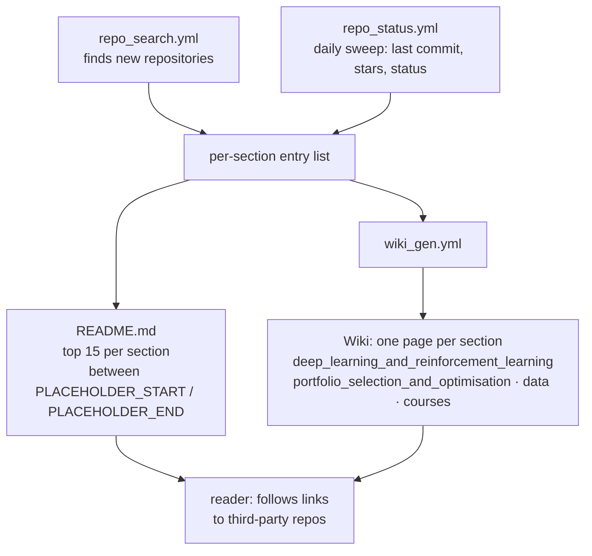

# firmai/financial-machine-learning

> **A directory of machine-learning-for-finance repositories, refreshed automatically every day.**

## The problem

Searching GitHub for "deep learning trading" returns thousands of repositories with no way to
tell which are alive and which are abandoned coursework. Sorting them by hand costs hours, and
a hand-written list frozen three years ago is worse than nothing: it points at dead code
without saying so.

## What it actually does

It is a list, but an instrumented one. The README states three checkable facts: the status of
every repo and link, **including last-commit date, is updated daily**; only the **15
highest-ranked entries per section** appear in the README, with the full list on the matching
wiki page; README and wikis are regenerated as soon as new information is pushed.

Every section is a table whose columns are repo, comment, created_at, last_commit, star_count,
a status marker (tick or cross) and a rating such as `:star:x5`. Sections cover trading (deep
learning and reinforcement learning, other models, data processing), portfolio management
(selection and optimisation, factor and risk analysis), techniques (unsupervised, textual),
other assets (derivatives and hedging, fixed income, alternative finance), then extended
research, courses, data sources and academic centres.

Three GitHub Actions workflows carry the automation, named by the badges at the top of the
README: `repo_status.yml`, `wiki_gen.yml`, `repo_search.yml`. Tables are injected between
`<!-- [PLACEHOLDER_START:<section>] -->` markers.

## How it is wired

No code-derived diagram exists for this repository: this one is rebuilt from the README alone,
using the three workflow badges, the `PLACEHOLDER` markers and the wiki links in each section
heading.

## Trying it

The README documents **no command at all**: no install, no script, no contribution procedure.
There is nothing to run and nothing is reconstructed here. Usage is to open the README for a
section's top 15, then the wiki page linked in that section's heading for the full list, and to
read the `last_commit` and `repo_status` columns before following any link.

## Cost and gotchas

- **Free, nothing to install, no API key**: it is a GitHub page you read.
- **The cost sits in the listed repositories.** Each entry carries its own requirements (GPU,
  paid market data, broker keys) that the list does not document.
- **The README is truncated by design**: 15 entries per section. What you want is often on the
  wiki, not the landing page.
- **Sparse columns**: many rows show `nan` for dates and stars (non-GitHub links, data sources,
  universities), and the comment is sometimes just `NEW`. The automated status says nothing
  about quality.
- **No licence is declared** on the repository, so the tables themselves have no explicit legal
  status — worth checking before reusing them in an internal deliverable.
- **The README is also a commercial shop window**: its opening sections advertise Sov.ai, its
  subscription product (`docs.sov.ai`), the ML-Quant.com service and a PhD recruitment call. The
  curation comes from a party that also sells data.

## What it is not

- **Not a library.** Nothing to import, no machine-learning code in the repository: only link
  tables and the tooling that regenerates them.
- **Not a hand-audited selection.** Ranking rests on automated signals (stars, activity); a
  green tick means a repo responds, not that it works or that its method is sound.
- **Not a promise of returns**: a strategy published on GitHub and backtested by its own author
  carries no guarantee whatsoever.

## Alternatives

| | When to prefer it |
|---|---|
| **microsoft/qlib** | A catalogue neighbour and the opposite of this list: a real quantitative research platform, to prefer as soon as you want to run models rather than discover repositories. |
| **freqtrade/freqtrade** | A catalogue neighbour; the list itself points at a derived `freqtrade_bot`. Prefer it when the goal is a crypto trading bot that runs, not a bibliography. |
| **Fincept-Corporation/FinceptTerminal** | A catalogue neighbour: a financial analysis terminal, to prefer for consulting market data rather than links to code. |

`practical-tutorials/project-based-learning` is not comparable: a general-purpose tutorial list
with no connection to quantitative finance.

## For you

Useful as a bibliographic entry point when you approach an unfamiliar finance/ML topic: the
last-commit column saves an afternoon spent on a dead repository. Watch it, do not adopt it: it
plugs into no technical pipeline, and the commercial pitch at the top of the README is reason
to cross-check the curation rather than trust it.
