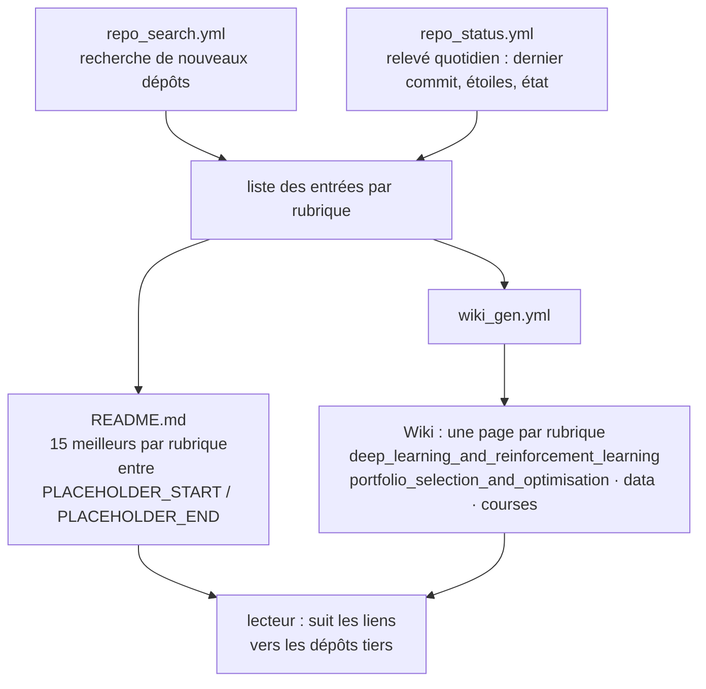

# firmai/financial-machine-learning

> **Un annuaire de dépôts d'apprentissage automatique appliqué à la finance, tenu à jour automatiquement.**

## Le problème

Chercher « deep learning trading » sur GitHub renvoie des milliers de dépôts dont on ne sait
ni lesquels vivent encore, ni lesquels relèvent du notebook d'exercice. Trier à la main coûte
des heures, et une liste figée écrite il y a trois ans est pire que rien : elle envoie vers du
code abandonné sans le signaler.

## Ce que ça fait vraiment

C'est une liste, mais une liste instrumentée. Le README annonce trois choses vérifiables :
l'état de tous les dépôts et liens, **date du dernier commit comprise, est mis à jour
quotidiennement** ; seuls les **15 dépôts les mieux classés de chaque rubrique** apparaissent
dans le README, la liste complète vivant dans la page wiki correspondante ; le README et les
wikis sont régénérés dès qu'une information est poussée.

Chaque rubrique est un tableau avec, par ligne : le dépôt, un commentaire, la date de
création, la date du dernier commit, le nombre d'étoiles, un indicateur d'état (coche ou
croix) et une mention du type `:star:x5`. Les rubriques couvrent le trading (apprentissage
profond et par renforcement, autres modèles, traitement des données), la gestion de
portefeuille (sélection et optimisation, analyse factorielle et de risque), les techniques
(non supervisé, textuel), les autres actifs (dérivés et couverture, taux, finance
alternative), puis la recherche étendue, les cours, les sources de données et les laboratoires
universitaires.

Trois workflows GitHub Actions portent l'automatisation, nommés par leurs badges en tête de
README : `repo_status.yml`, `wiki_gen.yml`, `repo_search.yml`. Les tableaux sont injectés
entre des marqueurs `<!-- [PLACEHOLDER_START:<rubrique>] -->` du fichier.

## Comment c'est branché

Aucun diagramme tiré du code n'existe pour ce dépôt : ce schéma est reconstruit depuis le
seul README, à partir des trois badges de workflows, des marqueurs `PLACEHOLDER` et des liens
de wiki placés dans chaque titre de rubrique.

## Essayer

Le README ne documente **aucune commande** : pas d'installation, pas de script, pas de
procédure de contribution. Il n'y a rien à lancer et rien n'est reconstruit ici. L'usage
consiste à ouvrir le README pour les 15 meilleures entrées d'une rubrique, puis la page wiki
liée dans le titre de la rubrique pour la liste complète, et à lire les colonnes « last_commit »
et « repo_status » avant de suivre un lien.

## Coût et pièges

- **Gratuit, rien à installer, aucune clé d'API** : on lit une page GitHub.
- **Le coût est déplacé chez les dépôts listés.** Chaque entrée a ses propres prérequis (GPU,
  données de marché payantes, clés de courtier) que la liste ne documente pas.
- **README tronqué par construction** : 15 entrées par rubrique seulement. Ce qu'on cherche est
  souvent dans le wiki, pas dans la page d'accueil.
- **Colonnes lacunaires** : de nombreuses lignes portent `nan` en date et en étoiles (liens hors
  GitHub, sources de données, universités), et le commentaire se réduit parfois à `NEW`. L'état
  automatique ne dit rien de la qualité.
- **Licence absente** du dépôt (aucune licence déclarée) : les tableaux eux-mêmes sont sans
  statut juridique explicite, à considérer avant toute reprise dans un livrable interne.
- **Le README est aussi une vitrine commerciale** : ses premières sections présentent Sov.ai,
  son offre d'abonnement (`docs.sov.ai`), le service ML-Quant.com et un appel à candidatures de
  doctorants. Le tri des rubriques est celui d'un acteur qui vend par ailleurs de la donnée.

## Ce que ce n'est pas

- **Ce n'est pas une bibliothèque.** Rien à importer, aucun code d'apprentissage automatique
  dans le dépôt : seulement des tableaux de liens et l'outillage qui les régénère.
- **Ce n'est pas une sélection éditorialisée ni auditée.** Le classement s'appuie sur des
  signaux automatiques (étoiles, activité) ; la coche verte dit qu'un dépôt répond, pas qu'il
  est utilisable ni que sa méthode est correcte.
- **Ce n'est pas une garantie de rentabilité** : une stratégie publiée sur GitHub et rétrotestée
  par son auteur ne transporte aucune promesse de résultat.

## Alternatives

| | Quand le préférer |
|---|---|
| **microsoft/qlib** | Voisin du catalogue, et le contraire de cette liste : une véritable plateforme de recherche quantitative, à préférer dès qu'on veut exécuter des modèles plutôt que découvrir des dépôts. |
| **freqtrade/freqtrade** | Voisin du catalogue ; la liste cite d'ailleurs un `freqtrade_bot` dérivé. À préférer quand l'objectif est un robot de trading crypto qui tourne, pas une bibliographie. |
| **Fincept-Corporation/FinceptTerminal** | Voisin du catalogue : un terminal d'analyse financière, à préférer pour consulter des données de marché plutôt que des liens vers du code. |

`practical-tutorials/project-based-learning` n'est pas comparable : liste de tutoriels
généralistes, sans lien avec la finance quantitative.

## Pour toi

Utile comme point d'entrée bibliographique quand on aborde un sujet finance/ML inconnu :
la colonne « dernier commit » évite de perdre un après-midi sur un dépôt mort. À surveiller,
pas à adopter : ça ne rentre dans aucune chaîne technique, et la vitrine commerciale qui
occupe le haut du README invite à recouper le tri plutôt qu'à s'y fier.
