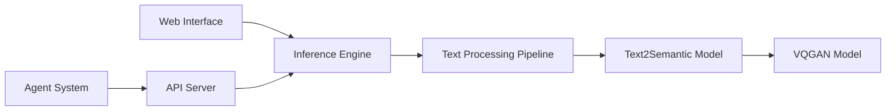

# fishaudio/fish-speech

> Synthèse vocale multilingue avec clonage de voix et contrôle d'émotion, poids ouverts sous licence restrictive.

## Le problème
Les TTS ouverts manquent d'expressivité fine et de clonage rapide dans de nombreuses langues.

## Ce que ça fait vraiment
Modèle S2-Pro (4B paramètres) Dual-AR : un AR lent pour le codebook sémantique, un AR rapide (400M) pour 9 codebooks résiduels.
Balises en langage naturel dans le texte (`[whisper]`, `[angry]`…), multi-locuteurs, dialogues multi-tours.
Clonage de voix sur 10 à 30 s d'audio ; 80+ langues.
Inférence CLI, WebUI, serveur, Docker ; accélération SGLang ou vLLM-Omni.

## Comment c'est branché

## Essayer
Aucune commande documentée dans le README : l'installation renvoie à la documentation externe.

## Coût et pièges
GPU conséquent (chiffres donnés sur H200). Licence « Fish Audio Research License » sur le code et les poids, avec menace explicite de poursuites en cas de violation.

## Ce que ce n'est pas
Pas open source au sens OSI : usage commercial non garanti. Les benchmarks sont ceux de l'éditeur.

## Alternatives
- GPT-SoVITS : cité dans les crédits, autre TTS à clonage.
- Bert-VITS2 : cité dans les crédits.

## Pour toi
Qualité à surveiller, mais lis la licence avant tout usage hors recherche.
