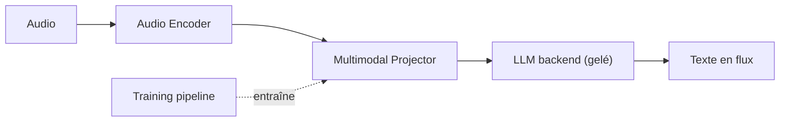

# fixie-ai/ultravox

> LLM multimodal qui comprend directement la parole, sans étape de reconnaissance vocale séparée.

## Le problème
Enchaîner ASR puis LLM ajoute de la latence et perd les indices de ton et de rythme.

## Ce que ça fait vraiment
Un projecteur multimodal convertit la sortie d'un encodeur audio dans l'espace d'un LLM ouvert (Llama 3, Mistral, Gemma). Le LLM et l'encodeur restent gelés : seul l'adaptateur est entraîné. Le modèle prend de l'audio en entrée et émet du texte en flux ; la génération de parole est prévue plus tard. Le dépôt contient l'entraînement, l'évaluation et les configs.

## Comment c'est branché


## Essayer
```bash
just install
poetry run python -m ultravox.training.train --config_path ultravox/training/configs/example_config.yaml
just eval --config_path ultravox/evaluation/configs/eval_config.yaml
```

## Coût et pièges
Le modèle par défaut est basé sur Llama 3.3 70B (variante 8B sur Hugging Face). Entraînement décrit sur 8 H100. L'outillage d'entraînement s'appuyait sur MosaicML, plateforme fermée fin juillet 2025.

## Ce que ce n'est pas
Ne génère pas de parole (texte en sortie seulement). L'API temps réel est un service managé de l'éditeur.

## Alternatives
Aucune alternative nommée dans le README.

## Pour toi
À surveiller : approche intéressante pour des agents vocaux à faible latence, mais le 70B demande beaucoup de GPU et la version la plus utile passe par l'offre payante de l'éditeur.
