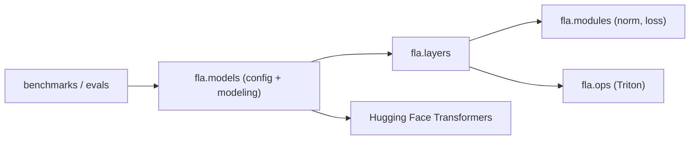

# fla-org/flash-linear-attention

> Briques Triton pour attention linéaire, modèles à espace d'états et hybrides, pour chercheurs en modèles de séquence.

## Le problème
Les articles sur l'attention linéaire et les SSM ont chacun leur dépôt, leurs noyaux et leurs conventions.

## Ce que ça fait vraiment
Collection de couches (`fla.layers`), de modèles compatibles Hugging Face Transformers (`fla.models`), de modules fusionnés (normalisations, entropie croisée, KL) et de noyaux Triton (`fla.ops`). Table de plus de 35 architectures (RetNet, GLA, DeltaNet, Mamba2, RWKV7, NSA, etc.). Modèles hybrides par le champ `attn`, cadre d'entraînement `flame` sur torchtitan, évaluation avec lm-evaluation-harness. Vérifié sur NVIDIA, AMD et Intel.

## Comment c'est branché


## Essayer
```bash
pip install flash-linear-attention[cuda]
pip install --index-url https://download.pytorch.org/whl/rocm7.2 torch
pip install flash-linear-attention[rocm]
python -m benchmarks.benchmark_generation --path 'fla-hub/gla-1.3B-100B' --repetition_penalty 2. --prompt="Hello everyone, I'm Songlin Yang"
python -m benchmarks.ops.run --op chunk_retention chunk_gla chunk_gdn flash_attn
```

## Coût et pièges
Gratuit, mais GPU nécessaire ; l'installation nue ne tire plus torch ni triton (choisir un extra `cuda`, `rocm`, `xpu`, `npu` ou `cpu`). L'entropie croisée fusionnée avec la couche linéaire est désactivée par défaut (précision moindre).

## Ce que ce n'est pas
Pas un catalogue de modèles préentraînés prêts pour la production. Les mesures du README montrent que FlashAttention2 reste plus rapide sur les petites formes (par ex. B=8, T=1024) : le gain dépend de la longueur de séquence.

## Alternatives
Liger-Kernel : cité pour l'entropie croisée linéaire fusionnée.

## Pour toi
À adopter si tu expérimentes ou entraînes des architectures de séquence sur GPU ; sinon sans objet.

