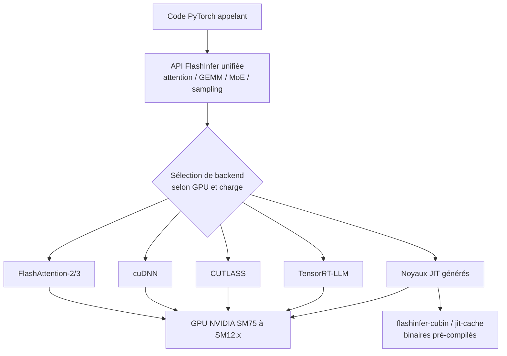

# flashinfer-ai/flashinfer

> **The GPU attention, GEMM and MoE kernels behind vLLM, SGLang and TensorRT-LLM, under one API.**

## The problem

Serving a language model quickly means hand-written CUDA kernels for every phase (prefill,
decode, append), every KV-cache layout and every GPU generation — work each inference engine
would otherwise redo on its own and then carry forward from Turing to Blackwell.

## What it actually does

The README calls FlashInfer a library **and a kernel generator** for inference. Concretely:

- **Attention**: paged and ragged KV-cache, separate decode / prefill / append kernels, MLA
  attention (DeepSeek), cascade attention for shared prefixes, block-sparse and variable
  block-sparse patterns, and POD-Attention fusing prefill and decode in a mixed batch.
- **GEMM**: BF16 (SM10.0+), FP8 with per-tensor and groupwise scaling, FP4 (NVFP4 and MXFP4 on
  Blackwell), grouped GEMM for LoRA and multi-expert routing.
- **MoE**: fused kernels, DeepSeek-V3 / Llama-4 / standard top-k routing, FP8 and FP4 expert
  weights with block-wise scaling.
- **Sorting-free sampling**: Top-K, Top-P and Min-P without a sort, plus chain speculative
  sampling for speculative decoding.
- **Communication and misc operators**: custom AllReduce, multi-node NVLink (MNNVL), NVSHMEM
  integration; RoPE (including LLaMA 3.1), RMSNorm / LayerNorm / Gemma-style norms, SiLU and
  GELU with fused gating.
- **Backend selection**: one unified API over FlashAttention-2/3, cuDNN, CUTLASS and
  TensorRT-LLM, with the backend picked for the hardware and workload.

## How it is wired

Calling code goes through the single Python API; below it a dispatcher picks a backend, and
missing kernels are JIT-compiled or fetched as pre-compiled cubins.



## Trying it

```bash
pip install flashinfer-python
flashinfer install-cubin-wheel
flashinfer install-jit-cache-wheel
flashinfer show-config
flashinfer list-modules
```

From source, as documented:

```bash
git clone https://github.com/flashinfer-ai/flashinfer.git --recursive
cd flashinfer
python -m pip install -v .
```

## Cost and gotchas

Free, Apache-2.0, no API key. An NVIDIA GPU is mandatory: the README covers SM 7.5 (T4, RTX 20)
through Blackwell SM 12.x (RTX 50, DGX Spark), and states plainly that not all features exist on
all compute capabilities — FP4 and the CuTe DSL kernels need Blackwell, BF16 GEMM needs SM 10.0+.
CUDA 12.9, 13.0 or 13.4 (the last one a preview toolkit with PyTorch nightly). The base package
**compiles or downloads kernels on first use**: without the `flashinfer-cubin` /
`flashinfer-jit-cache` wheels the first run pays a compile, and those wheels come from the
flashinfer.ai-hosted index — plan ahead for an offline machine. Editable installs need
`setuptools>=77`, and `--no-build-isolation` will not install build dependencies for you.

## What it is not

It is not a serving engine: no server, no scheduler, no concurrent request handling — vLLM,
SGLang and TensorRT-LLM, listed as adopters, do that and call FlashInfer underneath. It is not
vendor-neutral either: everything is NVIDIA CUDA, nothing for AMD or Apple. And it will not
speed up a Hugging Face model by itself; you call the operators one by one from your own code.

## Alternatives

- **dao-AILab/flash-attention** (acknowledged in the README): the reference attention kernel —
  pick it if you only need attention, without GEMM, MoE or sampling.
- **NVIDIA/TensorRT-LLM** (batch neighbour, and a FlashInfer backend): a full inference engine,
  the choice when you want a ready-made server instead of a box of operators.
- **vllm-project/vllm** (batch neighbour, and an adopter): same trade-off — serving engine, not
  a kernel library.

## For you

Adopt it if you serve LLMs in production or write your own engine: it is the kernel layer three
of the major engines already share, and the API is CUDAGraph- and torch.compile-compatible. Skip
it if you only consume a hosted model API or have no NVIDIA GPU.
