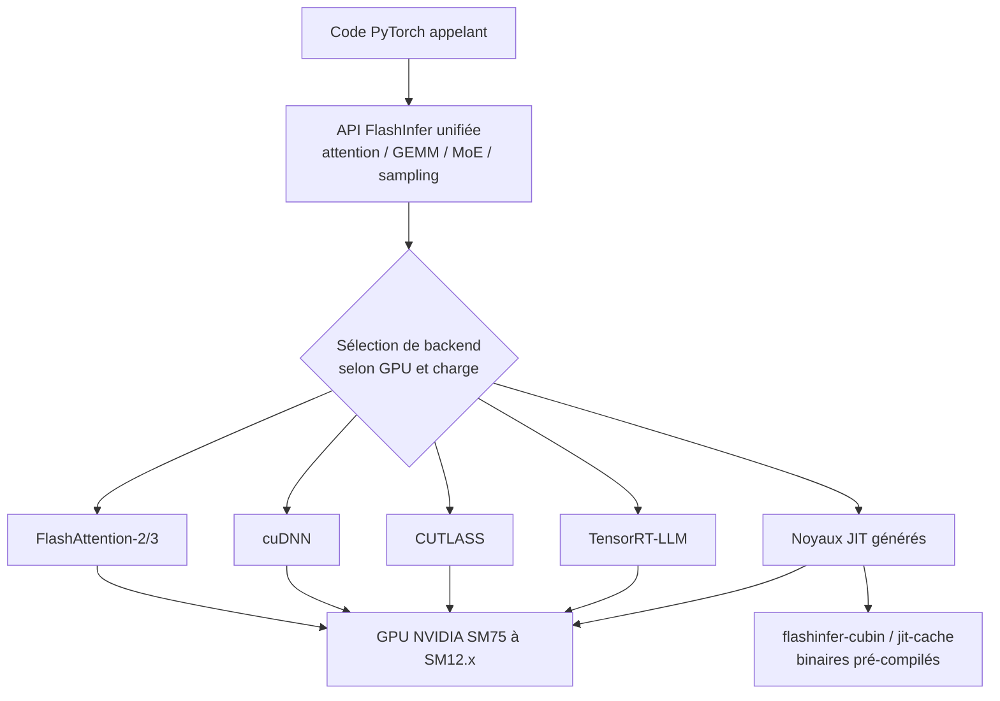

# flashinfer-ai/flashinfer

> **Les noyaux GPU d'attention, de GEMM et de MoE derrière vLLM, SGLang et TensorRT-LLM, sous une API unique.**

## Le problème

Servir un modèle de langage vite suppose des noyaux CUDA écrits à la main pour chaque phase
(prefill, decode, append), chaque format de KV-cache et chaque architecture de GPU — code que
chaque moteur d'inférence réécrirait sinon dans son coin, puis reporterait de Turing à Blackwell.

## Ce que ça fait vraiment

FlashInfer est décrit par son README comme une bibliothèque **et un générateur de noyaux** pour
l'inférence. Concrètement :

- **Attention** : KV-cache paginé et ragged, noyaux distincts pour decode / prefill / append,
  attention MLA (DeepSeek), attention en cascade pour préfixes partagés, motifs block-sparse,
  et POD-Attention qui fusionne prefill et decode dans un lot mixte.
- **GEMM** : BF16 (SM10.0+), FP8 avec mise à l'échelle par tenseur ou par groupe, FP4 (NVFP4 et
  MXFP4 sur Blackwell), GEMM groupé pour LoRA et routage multi-experts.
- **MoE** : noyaux fusionnés, routage DeepSeek-V3 / Llama-4 / top-k standard, poids d'experts
  quantifiés FP8 et FP4.
- **Échantillonnage sans tri** : Top-K, Top-P, Min-P sans passer par un tri, plus le
  *chain speculative sampling* pour le décodage spéculatif.
- **Communication et opérateurs divers** : AllReduce maison, MNNVL multi-nœuds, intégration
  NVSHMEM ; RoPE (dont LLaMA 3.1), RMSNorm / LayerNorm / Gemma, SiLU et GELU avec gating fusionné.
- **Sélection de backend** : une API unifiée au-dessus de FlashAttention-2/3, cuDNN, CUTLASS et
  TensorRT-LLM, le backend étant choisi selon le matériel et la charge.

## Comment c'est branché

Le code appelant passe par l'API Python unique ; sous elle, un dispatcher choisit un backend, et
les noyaux manquants sont compilés en JIT ou récupérés en cubins pré-compilés.



## Essayer

```bash
pip install flashinfer-python
flashinfer install-cubin-wheel
flashinfer install-jit-cache-wheel
flashinfer show-config
flashinfer list-modules
```

Installation depuis les sources, telle que documentée :

```bash
git clone https://github.com/flashinfer-ai/flashinfer.git --recursive
cd flashinfer
python -m pip install -v .
```

## Coût et pièges

Gratuit, Apache-2.0, aucune clé d'API. Il faut en revanche un GPU NVIDIA : le README couvre
SM 7.5 (T4, RTX 20) jusqu'aux Blackwell SM 12.x (RTX 50, DGX Spark), avec la mention explicite
que toutes les fonctions ne sont pas disponibles sur toutes les *compute capabilities* — le FP4
et les noyaux CuTe DSL demandent Blackwell, le BF16 GEMM du SM 10.0+. CUDA 12.9, 13.0 ou 13.4
(cette dernière en preview, avec PyTorch nightly). Le paquet de base **compile ou télécharge les
noyaux au premier appel** : sans les wheels `flashinfer-cubin` / `flashinfer-jit-cache`, le
premier lancement paie une compilation, et ces wheels se récupèrent depuis l'index hébergé
flashinfer.ai — à prévoir pour une machine hors ligne. L'installation éditable exige
`setuptools>=77`, et `--no-build-isolation` n'installe pas les dépendances de build.

## Ce que ce n'est pas

Ce n'est pas un moteur de service : pas de serveur, pas de scheduler, pas de gestion de requêtes
concurrentes — vLLM, SGLang et TensorRT-LLM, cités comme adoptants, font ce travail et appellent
FlashInfer par en dessous. Ce n'est pas non plus multi-fournisseur : tout est CUDA NVIDIA, rien
pour AMD ou Apple. Et ce n'est pas un accélérateur automatique d'un modèle Hugging Face : on
appelle les opérateurs un par un depuis son propre code.

## Alternatives

- **dao-AILab/flash-attention** (cité en remerciement du README) : le noyau d'attention de
  référence — à préférer si on ne veut que de l'attention, sans GEMM, MoE ni sampling.
- **NVIDIA/TensorRT-LLM** (voisin du lot, et backend de FlashInfer) : moteur d'inférence complet
  à prendre si on veut un serveur clé en main plutôt qu'une boîte d'opérateurs.
- **vllm-project/vllm** (voisin du lot, et adoptant) : même arbitrage — moteur de service, pas
  bibliothèque de noyaux.

## Pour toi

À adopter si tu sers des LLM en production ou si tu écris ton propre moteur : c'est la couche de
noyaux que trois des moteurs majeurs partagent déjà, et l'API est compatible CUDAGraph et
torch.compile. Passe ton chemin si tu ne fais que consommer une API de modèle ou si tu n'as pas
de GPU NVIDIA.
