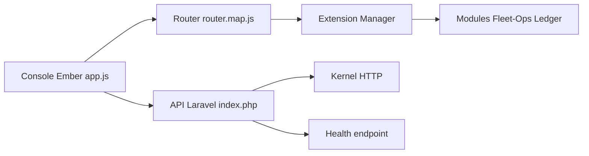

# fleetbase/fleetbase

> Système d'exploitation logistique modulaire (dispatch, flotte, entrepôt, facturation), auto-hébergé ou en cloud.

## Le problème
Les transporteurs et livreurs dépendent de TMS propriétaires difficiles à adapter.

## Ce que ça fait vraiment
Une console Ember.js et une API Laravel. Les fonctions s'installent comme extensions : Fleet-Ops (commandes, chauffeurs, suivi), Storefront, Pallet (entrepôt), Ledger (facturation), Customer Portal, IAM, Developers (clés d'API, webhooks) et un module IA qui crée des commandes en langage naturel via OpenAI ou Claude. Deux applications mobiles, pour chauffeurs et pour boutiques, sont open source. Le code des modules opérationnels n'est pas dans ce dépôt.

## Comment c'est branché


## Essayer
```bash
npm install -g @fleetbase/cli
flb install-fleetbase
# console: http://localhost:4200 ; API: http://localhost:8000
```

## Coût et pièges
Docker Compose v2, Git, Node 18+, 4 Go de RAM alloués à Docker. La messagerie, les cartes et les SMS se configurent ensuite. Une offre Fleetbase Cloud existe (essai gratuit).

## Ce que ce n'est pas
Pas un outil d'IA ou de données : c'est une application métier. La licence AGPL-3.0 impose de publier les modifications si tu l'offres en service réseau.

## Alternatives
Aucune alternative n'est citée dans le README.

## Pour toi
À ignorer pour un profil data/IA/MLOps : hors sujet, AGPL, sauf projet logistique précis (le module IA n'est qu'un ajout).
