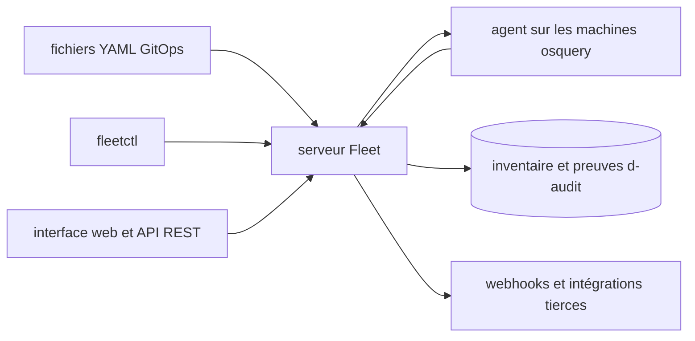

# fleetdm/fleet

> **Open-source device management and inventory for IT and security teams running large fleets.**

## The problem

Without a tool like this, a fleet of thousands of machines is run by stacking one agent per
OS: an MDM for macOS, another for Windows, nothing for Linux, and no shared inventory.
Answering "which machines run this software, at which version" becomes a project, and
gathering audit evidence is done by hand.

## What it actually does

Fleet offers a single system to secure and maintain machines over the air: MDM, patching,
software deployment and state verification. It reads data and events from the native
operating system and, per the README, reports hundreds of attributes per device. It ships
CIS benchmarks for macOS and Windows plus a reference of queryable tables. Configuration is
driven through GitOps YAML files, or through the GUI, the REST API, webhooks and the
`fleetctl` command-line tool. The README stresses modularity: MDM can be used without the
security side, and unused features can be turned off.

## How it is wired



The README describes three equivalent entry paths into the server — versioned YAML files,
`fleetctl`, and the web UI plus REST API — an agent built on osquery collecting on each
device, and outputs to a queryable inventory and to webhook events consumed by Snowflake,
Splunk, GitHub Actions, Vanta, Elastic, Jira or Zendesk. No source file is named in the
README, so this diagram stays at the level of components.

## Trying it

```bash
# No install command is documented in the README.
# It points to fleetdm.com/pricing for a trial and fleetdm.com/download for fleetctl.
```

The README carries no install command, no `docker run`, no start-up procedure: everything
goes through links to the project website. Nothing was reconstructed here.

## Cost and traps

The README states the free version will stay free, but also mentions a commercial license
and paid features; the exact split between the two is not documented here. The declared
repository license is `NOASSERTION`, while the README mentions MIT for the free part and a
`LICENSE.md` for the rest — read it before committing. The trial requires an account on the
website. Deploying implies a server to host and an agent to push onto every machine, which
the README does not size. An inventory agent across a whole fleet raises a data governance
question by nature, even though the README states it does not collect keystrokes, emails or
webcams.

## What it is not

It is not an EDR or an antivirus: the README places it alongside CrowdStrike and SentinelOne,
not in their place. It is not a turnkey product without infrastructure — a server and a
deployed agent are required. Nor is it a data science or ML tool: this is fleet
administration, even if the inventory it produces is a usable data source.

## Alternatives

The README names no direct competitor, only its building blocks and ecosystem neighbours.
`osquery/osquery` is the underlying collection layer: preferable if you only want to query
machines, without a server or MDM. `micromdm/nanomdm` is the MDM brick alone, simpler if the
need stops there. Among the supplied neighbours none is comparable: `infobyte/faraday` does
vulnerability management, `anchore/syft` software package inventories, and the other two are
off topic.

## For you

Little direct value for data or MLOps work, unless you have to equip your team's fleet or
produce compliance evidence. The useful angle: the inventory it produces can be exported to
Snowflake or Splunk, making it a clean source if you build compliance dashboards. Otherwise,
watch it from a distance.
