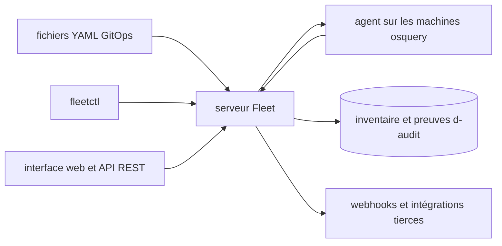

# fleetdm/fleet

> **Gestion et inventaire de parc machine en open source, pour équipes IT et sécurité.**

## Le problème

Sans outil de ce type, un parc de milliers de postes se gère avec un empilement d'agents par
OS : un MDM pour macOS, un autre pour Windows, rien pour Linux, et aucun inventaire commun.
Répondre à « quelles machines ont ce logiciel, dans quelle version » devient un projet, et
collecter des preuves d'audit se fait à la main.

## Ce que ça fait vraiment

Fleet expose un seul système pour sécuriser et maintenir les machines à distance : MDM,
application de correctifs, déploiement de logiciels et vérification d'état. Il lit les
données et les événements du système d'exploitation natif, et remonte selon le README des
centaines d'attributs par machine. Il embarque les benchmarks CIS pour macOS et Windows et
une référence de tables interrogeables. La configuration se pilote en GitOps via des
fichiers YAML, ou via l'interface graphique, l'API REST, des webhooks et l'outil en ligne de
commande `fleetctl`. Le README insiste sur la modularité : on peut utiliser le MDM sans la
partie sécurité, et désactiver les fonctions inutilisées.

## Comment c'est branché



Le README décrit trois voies d'entrée équivalentes vers le serveur — les fichiers YAML
versionnés, `fleetctl`, l'interface web et l'API REST — un agent bâti sur osquery qui
collecte sur chaque machine, et des sorties vers l'inventaire consultable et des événements
webhook consommés par Snowflake, Splunk, GitHub Actions, Vanta, Elastic, Jira ou Zendesk.
Aucun fichier de code n'est nommé dans le README, ce diagramme reste donc au niveau des
pièces.

## Essayer

```bash
# Aucune commande d'installation n'est documentée dans le README.
# Il renvoie vers fleetdm.com/pricing pour l'essai et fleetdm.com/download pour fleetctl.
```

Le README ne contient ni commande d'installation, ni `docker run`, ni procédure de
démarrage : tout passe par des liens vers le site du projet. Rien n'a été reconstruit ici.

## Coût et pièges

Le README annonce que la version gratuite restera gratuite, mais parle aussi d'une licence
commerciale et de fonctions payantes : le partage exact entre les deux n'est pas documenté
ici. La licence déclarée côté dépôt est `NOASSERTION`, le README évoquant MIT pour la partie
libre et un `LICENSE.md` pour le reste — à lire avant tout engagement. L'essai passe par un
compte sur le site. Déployer suppose un serveur à héberger et un agent à pousser sur chaque
machine, ce que le README ne chiffre pas. Un agent d'inventaire sur tout le parc pose par
nature une question de gouvernance de la donnée, même si le README affirme ne pas collecter
frappes clavier, courriels ni webcam.

## Ce que ce n'est pas

Ce n'est pas un EDR ni un antivirus : le README le positionne à côté de CrowdStrike et
SentinelOne, pas à leur place. Ce n'est pas un produit clé en main sans infrastructure — il
faut un serveur et un agent déployé. Ce n'est pas non plus un outil de data science ou de
ML : c'est de l'administration de parc, même si l'inventaire qu'il produit est une source de
données exploitable.

## Alternatives

Le README ne nomme aucun concurrent direct, seulement ses briques et ses voisins d'écosystème.
`osquery/osquery` est la couche de collecte sous-jacente : à préférer si l'on veut seulement
interroger des machines, sans serveur ni MDM. `micromdm/nanomdm` est la brique MDM seule,
plus simple si le besoin s'arrête là. Parmi les voisins fournis, aucun n'est comparable :
`infobyte/faraday` fait de la gestion de vulnérabilités, `anchore/syft` des inventaires de
paquets logiciels, et les deux autres sont hors sujet.

## Pour toi

Peu d'intérêt direct pour un travail data ou MLOps, sauf si tu dois outiller le parc de ton
équipe ou fournir des preuves de conformité. L'angle utile : l'inventaire qu'il produit est
exportable vers Snowflake ou Splunk, donc une source propre si tu construis des tableaux de
bord de conformité. Sinon, à surveiller de loin.
