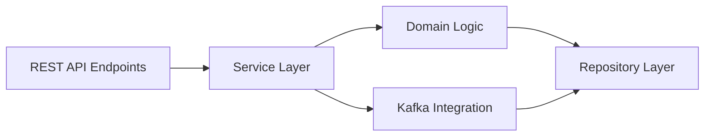

# flexprice/flexprice

> Infrastructure de facturation à l'usage et par crédits, auto-hébergeable, pour équipes SaaS et IA.

## Le problème
Les outils de facturation classiques gèrent mal le comptage d'événements, les crédits prépayés et les tarifs hybrides ; les équipes bricolent leur propre logique.

## Ce que ça fait vraiment
Reçoit des événements d'usage par API/SDK, les agrège en temps réel, applique plans, crédits, limites de fonctionnalités, puis génère les factures. Se branche à Stripe, Chargebee, CRM et compta. L'architecture code décrit PostgreSQL, ClickHouse, Kafka, Temporal et une architecture en couches (API, services, domaine, dépôts).

## Comment c'est branché


## Essayer
```bash
git clone https://github.com/flexprice/flexprice
cd flexprice
make dev-setup
```

## Coût et pièges
Pile lourde à héberger : PostgreSQL, Kafka, ClickHouse, Redis, Temporal. Prérequis Go et Docker Compose. Licence AGPL-3.0.

## Ce que ce n'est pas
Pas un simple module de paiement : il complète un processeur de paiement existant. Le README ne donne pas de procédure de déploiement en production, seulement l'environnement de développement.

## Alternatives
- Stripe / Chargebee : le README les cite comme processeurs à compléter, pas à remplacer.

## Pour toi
À surveiller : pertinent si tu factures une API ou des tokens d'IA, mais AGPL et une pile Kafka/ClickHouse à opérer pèsent lourd pour un usage isolé.
