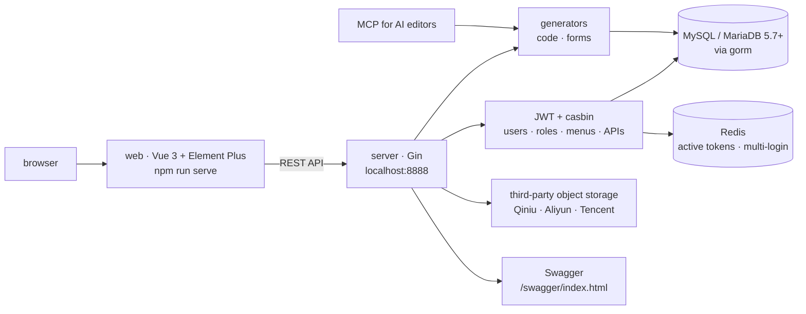

# flipped-aurora/gin-vue-admin

> **A Go + Vue 3 admin application scaffold, with permissions, dynamic menus and a code generator.**

## The problem

Every back-office starts with the same weeks of work: login, tokens, roles, dynamic menus,
per-API permissions, pagination, file upload, and hand-written CRUD for each table. Without a
scaffold, each Go + Vue project rebuilds that layer differently, and the permission model is
re-litigated every time.

## What it actually does

The README presents it as a full-stack development base platform with separated front and
back ends: a `server` folder running Gin and a `web` folder running Vue. The README is
explicit that you open `server` in the IDE, not the repository root.

What the repository itself ships, per the README's feature list:

- **authentication and permissions**: JWT for identity, `casbin` for authorization, with
  management screens for users, roles, menus and APIs — a role is granted API permissions and
  menu permissions, which is how each role gets a different dynamic menu;
- **multi-session interception**: Redis holds the JWT of currently active users, which is
  what makes it possible to limit simultaneous logins;
- **a code generator** for base logic and simple CRUD, plus a **form generator** built on
  `vform666/variant-form`;
- **upload and download**, including chunked upload for large files, implemented against the
  object storage services of Qiniu, Alibaba Cloud and Tencent Cloud;
- **worked examples**: pagination wrapped in front-end `mixins`, conditional search, RESTful
  sample APIs in the user module, and configuration editable from the UI (disabled on the
  public demo).

The top of the README announces an **MCP adapted to AI editors** and a five-step chain
(create a base template, have the AI generate the structure, generate the code, assign
permissions, get the CRUD), documented by a video rather than by text. There is also support
for the "Claw" ecosystem, pointing at a plugin-market entry. The "skills management" claimed
by the catalogue description does not appear in this README: undocumented.

## How it is wired



No code-derived diagram exists for this repository: the graph above is reconstructed from the
README alone, and names only the two folders it mentions, `server` and `web`.

## Trying it

Commands copied from the README. Stated prerequisites: Node > v18.16.0, Go >= v1.22.

```bash
# 克隆项目
git clone https://github.com/flipped-aurora/gin-vue-admin.git
# 进入server文件夹
cd server

# 使用 go mod 并安装go依赖包
go generate

# 运行
go run . 
```

```bash
# 进入web文件夹
cd web

# 安装依赖
npm install

# 启动web项目
npm run serve
```

Optional Swagger documentation:

```bash
go install github.com/swaggo/swag/cmd/swag@latest
cd server
swag init
```

The README gives no command for creating the database, running migrations or writing the
configuration: initialization is deferred to an online guide. There is also a VSCode
workspace file, `gin-vue-admin.code-workspace`, with a `Both (Backend & Frontend)` task that
starts both sides together. A public demo is offered with `admin` / `123456`.

## Cost and traps

The code is under Apache License 2.0, so it is free to use, modify and redistribute as long
as the notices the licence requires are kept. The cost sits around the code:

- **infrastructure you must provide**: MySQL or MariaDB 5.7+ on InnoDB, and Redis as soon as
  you want the multi-login limit. Nothing here is install-free;
- **two build toolchains**: Go >= 1.22 on the server side (the README badges still show
  golang 1.20, a contradiction it does not explain), Node > 18.16 on the web side;
- **accounts with third-party providers** for upload as implemented: Qiniu, Alibaba Cloud or
  Tencent Cloud — three Chinese offerings, billed on their side, to be swapped out yourself
  if you want local or European storage;
- **support**: the README states plainly that no free technical service is provided, since
  everything is covered by the tutorials and documentation; help goes through a paid-support
  page. There is also a **licensed edition** with its own demo site, a plugin market, and a
  commercial-licence purchase page for that edition's features and official support. Where
  exactly the open edition stops and the licensed one begins is not described in the README;
- **language**: the online documentation, the videos (bilibili) and the community (QQ group,
  WeChat group, forum) are mostly in Chinese. The README links a `README-en.md`, but the way
  into the project — initialization guide, video tutorials, peer help — is Chinese.

The README also warns that some existing grounding in Go and Vue is expected: this is not
something to install without being able to read both.

## What it is not

- **Not a finished product.** It is a scaffold: you start from the repository and write your
  own domain inside it. The shipped modules are presented as examples and a base of common
  functions, not as a completed admin application you merely configure.
- **Not approachable without Chinese.** The code and an English README exist, but the
  initialization guide, the tutorials and the community are Chinese-speaking: for a
  non-Chinese team that is a real, permanent reading cost, not a cosmetic detail.
- **Not an AI tool and not a standalone MCP service.** The announced MCP is there to generate
  admin code from an AI editor; it does not turn the project into an agent platform.
- **Not stack-agnostic**: you inherit a whole imposed stack — Gin, gorm, Vue, Element, Redis,
  MySQL, viper, zap, Swagger — which you either keep or leave, but do not pick à la carte.

## Alternatives

No comparable alternative in the catalogue: the suggested neighbours do not answer the same
need for a Go + Vue admin scaffold.

| | Why it is not a replacement |
|---|---|
| **langgenius/dify** | A platform for agentic workflow development: a different subject, not a permissioned back-office with CRUD. |
| **sleuth-io/sx** | A package manager for AI coding assistants: a workstation tool, unrelated to an application scaffold. |
| **Snailclimb/JavaGuide** and **xerrors/Yuxi** | Neighbours by vocabulary only; nothing in the local material makes them comparable. |

The README names no competitor: the repositories it cites (`gin-gonic/gin`, `vuejs`,
`ElemeFE/element`, `gorm`, `vform666/variant-form`, `viper`, `fsnotify`, `uber-go/zap`,
`swaggo/swag`) are its own building blocks, not substitutes.

## For you

Skip it for a data / AI / MLOps profile: this is a Go + Vue back-office scaffold with an
imposed stack and Chinese-language documentation, far from a data tool or a model platform.
The one reason to reopen this sheet would be having to ship an internal admin UI on a backend
that is already Go — and then the code generator, the JWT/casbin pair and the multi-session
interception are the parts worth reading.
