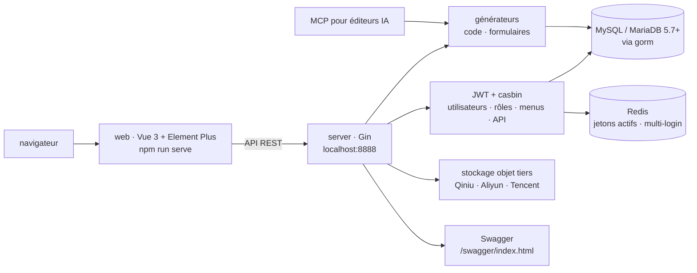

# flipped-aurora/gin-vue-admin

> **Un socle d'application d'administration Go + Vue 3, avec droits, menus et générateur de code.**

## Le problème

Tout back-office recommence par les mêmes semaines de travail : connexion, jetons, rôles,
menus dynamiques, droits par API, pagination, upload de fichiers, et un CRUD écrit à la main
par table. Sans socle, chaque projet Go + Vue réinvente cette couche, différemment, et la
sécurité des droits se rejoue à chaque fois.

## Ce que ça fait vraiment

Le README se décrit comme une plateforme de développement full-stack front/back séparés :
un dossier `server` en Gin et un dossier `web` en Vue, à ouvrir séparément — le README
insiste : on ouvre `server`, pas la racine.

Ce que le dépôt fournit lui-même, d'après la liste de fonctions du README :

- **l'authentification et les droits** : JWT pour l'identité, `casbin` pour les autorisations,
  avec gestion des utilisateurs, des rôles, des menus et des API — un rôle reçoit des droits
  d'API et des droits de menu, d'où des menus dynamiques différents par rôle ;
- **l'interception des connexions multiples** : Redis retient le jeton JWT des utilisateurs
  actifs, ce qui permet de limiter les sessions simultanées ;
- **un générateur de code** pour la logique de base et le CRUD simple, et un **générateur de
  formulaires** qui s'appuie sur `vform666/variant-form` ;
- **l'upload/download**, y compris l'upload par fragments pour les gros fichiers, implémenté
  sur les stockages objet de Qiniu, Alibaba Cloud et Tencent Cloud ;
- **des exemples** : pagination encapsulée côté front par des `mixins`, recherche
  conditionnelle, API RESTful d'exemple dans le module utilisateurs, configuration modifiable
  depuis l'interface (désactivée sur la démo en ligne).

Le haut du README annonce un **MCP adapté aux éditeurs IA** et une chaîne en cinq étapes
(créer un modèle de base, faire générer la structure par l'IA, générer le code, attribuer les
droits, CRUD obtenu), documentée par une vidéo plutôt que par du texte. Un support de
l'écosystème « Claw » renvoie à une fiche du marché de plugins. La « gestion de skills »
annoncée par la description du catalogue n'apparaît pas dans ce README : non documenté.

## Comment c'est branché



Aucun diagramme tiré du code n'existe pour ce dépôt : ce schéma est reconstruit depuis le
seul README, et ne nomme que les deux dossiers qu'il cite, `server` et `web`.

## Essayer

Commandes copiées du README. Prérequis annoncés : Node > v18.16.0, Go >= v1.22.

```bash
# 克隆项目
git clone https://github.com/flipped-aurora/gin-vue-admin.git
# 进入server文件夹
cd server

# 使用 go mod 并安装go依赖包
go generate

# 运行
go run . 
```

```bash
# 进入web文件夹
cd web

# 安装依赖
npm install

# 启动web项目
npm run serve
```

Documentation Swagger, en option :

```bash
go install github.com/swaggo/swag/cmd/swag@latest
cd server
swag init
```

Le README ne donne aucune commande de création de base de données, de migration ni de
configuration : l'initialisation est renvoyée à un guide en ligne. Il existe aussi un fichier
d'espace de travail VSCode, `gin-vue-admin.code-workspace`, avec une tâche
`Both (Backend & Frontend)` pour lancer les deux côtés ensemble. Une démo en ligne est
proposée avec `admin` / `123456`.

## Coût et pièges

Le code est sous Apache License 2.0, donc gratuit à utiliser, modifier et redistribuer à
condition de conserver les mentions exigées par la licence. Ce qui coûte est autour :

- **de l'infrastructure à fournir** : MySQL ou MariaDB 5.7+ en InnoDB, et Redis dès qu'on veut
  la limitation de connexions multiples. Rien n'est « rien à installer » ici ;
- **une chaîne de compilation double** : Go >= 1.22 côté serveur (les badges du README
  affichent encore golang 1.20, contradiction non expliquée), Node > 18.16 côté web ;
- **des comptes chez des fournisseurs tiers** pour l'upload tel qu'il est implémenté : Qiniu,
  Alibaba Cloud ou Tencent Cloud — trois offres chinoises, facturées chez elles, à remplacer
  soi-même si l'on veut un stockage local ou européen ;
- **le support** : le README dit explicitement qu'aucun service technique gratuit n'est
  fourni, tout étant renvoyé aux tutoriels et à la documentation ; l'assistance passe par une
  page de support payant. Il existe par ailleurs une **version sous licence** avec une démo
  séparée, un marché de plugins, et une page d'achat de licence commerciale pour les
  fonctions de cette version et le support officiel. La frontière exacte entre l'édition
  ouverte et l'édition sous licence n'est pas décrite dans le README ;
- **la langue** : documentation en ligne, vidéos (bilibili), communauté (groupe QQ, WeChat,
  forum) essentiellement en chinois. Le README renvoie à un `README-en.md`, mais l'entrée
  dans le projet — guide d'initialisation, tutoriels vidéo, entraide — se fait en chinois.

Le README prévient aussi qu'il faut « une certaine base » en Go et en Vue : ce n'est pas un
produit à installer sans savoir lire les deux.

## Ce que ce n'est pas

- **Ce n'est pas un produit fini.** C'est un échafaudage : on part du dépôt et on écrit son
  métier dedans. Les modules livrés sont présentés comme des exemples et une base de
  fonctions communes, pas comme une application d'administration achevée qu'on paramètre.
- **Ce n'est pas un projet abordable sans le chinois.** Le code et une version anglaise du
  README existent, mais le guide d'initialisation, les tutoriels et la communauté sont
  sinophones : pour une équipe francophone, c'est un coût de lecture réel et permanent, pas
  un détail cosmétique.
- **Ce n'est pas un outil d'IA ni un service MCP autonome.** Le MCP annoncé sert à faire
  générer du code d'administration depuis un éditeur IA ; il ne transforme pas le projet en
  plateforme d'agents.
- **Ce n'est pas du tout-Go ni du tout-Python** : on hérite d'une pile complète imposée —
  Gin, gorm, Vue, Element, Redis, MySQL, viper, zap, Swagger — qu'on garde ou qu'on quitte,
  mais qu'on ne choisit pas à la carte.

## Alternatives

Aucune alternative comparable dans le catalogue : les voisins proposés ne répondent pas au
même besoin d'un socle d'administration Go + Vue.

| | Pourquoi ce n'est pas un remplaçant |
|---|---|
| **langgenius/dify** | Plateforme de développement de workflows agentiques : un autre sujet, pas un back-office à droits et CRUD. |
| **sleuth-io/sx** | Gestionnaire de paquets pour assistants de code : outil de poste de travail, sans rapport avec un socle applicatif. |
| **Snailclimb/JavaGuide** et **xerrors/Yuxi** | Rapprochés par lexique seulement ; rien dans la matière locale ne les rend comparables. |

Le README ne nomme aucun concurrent : les dépôts qu'il cite (`gin-gonic/gin`, `vuejs`,
`ElemeFE/element`, `gorm`, `vform666/variant-form`, `viper`, `fsnotify`, `uber-go/zap`,
`swaggo/swag`) sont ses propres briques, pas des solutions de rechange.

## Pour toi

À laisser de côté pour un profil data / IA / MLOps : c'est un socle de back-office Go + Vue,
avec une pile imposée et une documentation sinophone, très loin d'un outil de données ou de
plateforme de modèles. La seule raison de rouvrir cette fiche serait de devoir livrer une
interface d'administration interne sur un backend déjà en Go — et alors le générateur de
code, la paire JWT/casbin et l'interception multi-session sont ce qu'il y a à regarder.
